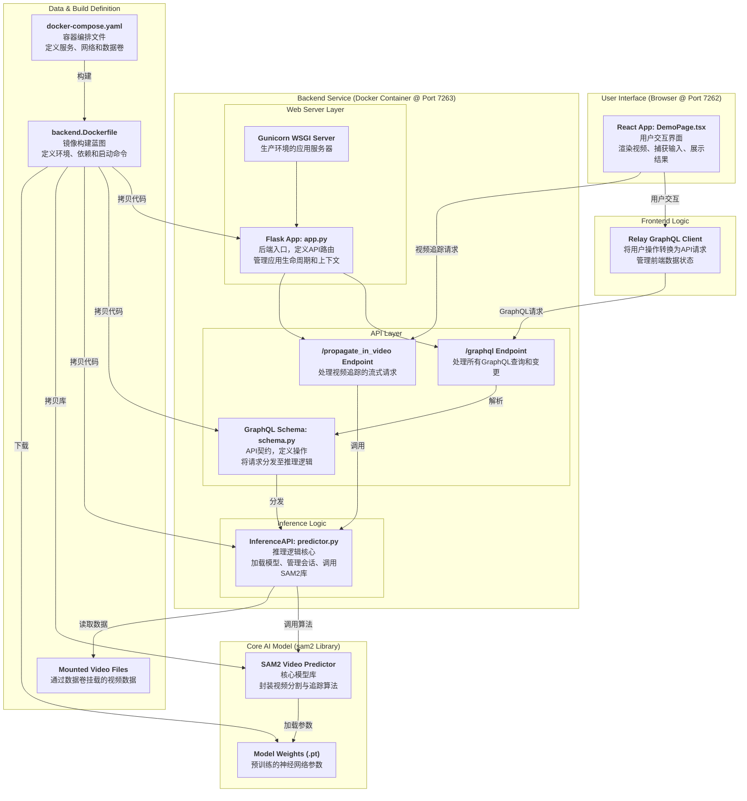
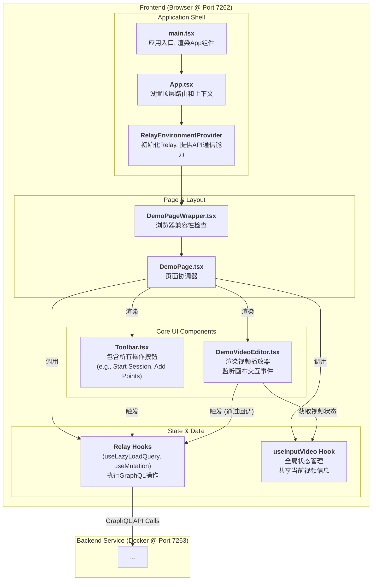
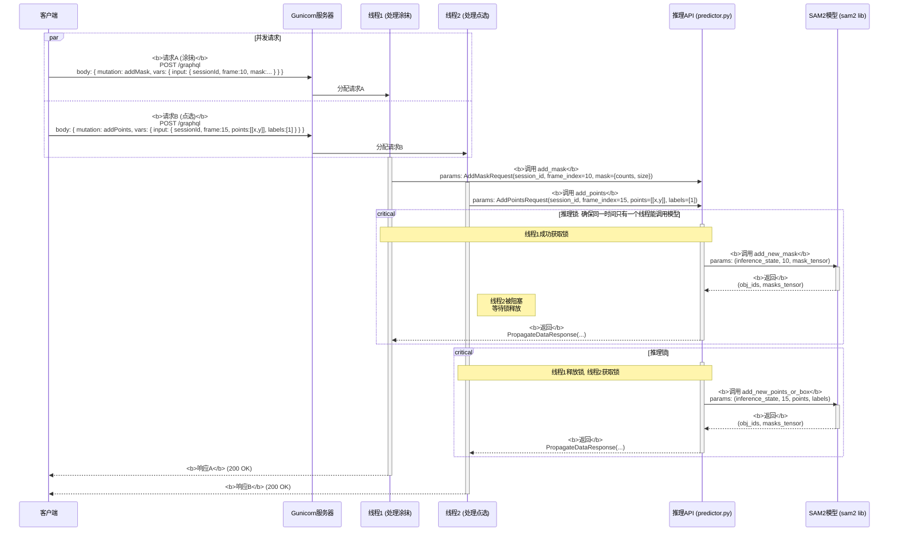
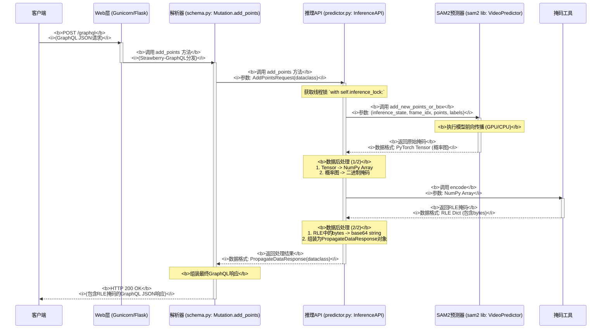

# SAM2 Demo 二次开发分析报告

## 第一部分：容器构建、文件组织与模块功能分析

本文档旨在为 SAM2 Demo 的二次开发提供技术参考。我们将深入分析其容器构建流程、代码组织结构以及核心模块的功能。

### 1. 容器构建流程 (后端服务)

后端的容器化是整个 Demo 的核心，其构建流程由 [`docker-compose.yaml`](docker-compose.yaml) 和 [`backend.Dockerfile`](backend.Dockerfile) 共同定义。

#### 1.1. 部署入口 (`docker-compose.yaml`)

-   **服务定义**: 定义了 `frontend` 和 `backend` 两个服务。
-   **构建上下文**: 后端服务的构建上下文是项目根目录 (`.`)，并指定使用 [`backend.Dockerfile`](backend.Dockerfile) 进行构建。
-   **端口映射**: 将容器内的 `5000` 端口映射到主机的 `7263` 端口 (`7263:5000`)。
-   **数据卷**: 将本地的 `./demo/data/` 目录挂载到容器的 `/data/`，实现了示例视频的动态加载。
-   **环境变量**: 设置了 Gunicorn、API URL 和默认视频路径等关键环境变量。
-   **GPU 支持**: `deploy` 部分尝试为容器分配 NVIDIA GPU 资源，但这在非 NVIDIA 环境（如 macOS）下无效。

#### 1.2. 镜像构建 (`backend.Dockerfile`)

-   **基础镜像**: `pytorch/pytorch:2.5.1-cuda12.1-cudnn9-runtime`。这决定了我们的运行环境是基于 PyTorch 2.5.1 和 CUDA 12.1 的。二次开发时，如果需要不同版本的 PyTorch 或 CUDA，需要从这里修改。
-   **系统依赖**: 使用 `apt-get` 安装了 `ffmpeg` 等工具，这是后端处理视频文件的基础。
-   **Python 依赖**:
    - 关键指令是 `pip install -e ".[interactive-demo]"`。
    - 这条指令会根据 [`setup.py`](setup.py) 安装项目核心依赖以及 `interactive-demo` 类别下的所有包。
    - `interactive-demo` 依赖包括：`Flask` (Web框架), `gunicorn` (应用服务器), `strawberry-graphql` (GraphQL库), `av` (视频处理) 等。这为我们提供了二次开发所需的技术栈概览。
-   **文件复制**:
    - 将本地的 [`demo/backend/server`](demo/backend/server/) 复制到容器的 `/opt/sam2/server/`。
    - 将本地的 [`sam2`](sam2/) (模型核心代码) 复制到容器的 `/opt/sam2/server/sam2/`。
    - 这种结构意味着容器内的后端服务可以直接调用 `sam2` 库。
-   **模型下载**:
    - 使用 `ADD` 指令从网络直接下载了四个不同大小的 `.pt` 模型文件到容器的 `/opt/sam2/checkpoints/` 目录。
    - **二次开发关键点**: 这意味着模型是**静态打包**在镜像中的。如果需要更换或添加新模型，最直接的方式是修改此 `Dockerfile`。更灵活的方案是改为在 `docker-compose.yaml` 中使用数据卷挂载外部的模型目录。
-   **启动命令**: 使用 `gunicorn` 启动位于 [`app.py`](demo/backend/server/app.py) 中的 `app` 实例，并暴露在 `5000` 端口。

---

### 2. 文件组织与模块功能

#### 2.1. 整体文件结构 (二次开发视角)

```
/
├── docker-compose.yaml       # 部署入口，定义服务和环境
├── backend.Dockerfile          # 后端容器构建蓝图
├── setup.py                    # 定义项目和Python依赖
│
├── demo/
│   ├── backend/server/         # 【后端核心代码】
│   │   ├── app.py              # Flask应用入口，GraphQL端点
│   │   ├── data/
│   │   │   ├── schema.py       # 【关键】GraphQL Schema 定义
│   │   │   └── loader.py       # 数据加载逻辑
│   │   └── inference/
│   │       └── predictor.py    # 【关键】模型推理核心逻辑
│   │
│   ├── frontend/               # 【前端核心代码】
│   │   └── ... (React, antd, etc.)
│   │
│   └── data/                   # 挂载到容器的示例数据
│
├── sam2/                       # SAM2 模型核心库
│   ├── modeling/               # 模型结构定义
│   └── ...
│
└── checkpoints/                # 模型权重文件存放目录
    └── download_ckpts.sh       # 本地部署时下载模型的脚本
```

#### 2.2. 核心模块功能

-   **后端服务 (`demo/backend/server/`)**:
    -   **`app.py`**: Flask 应用的入口。它初始化 Flask-CORS 用于跨域，并设置了一个指向 `/graphql` 的路由，该路由由 `strawberry-graphql` 的 `GraphQLView` 处理。这是所有 API 请求的入口点。
    -   **`data/schema.py`**: **前后端交互的契约**。这里使用 Strawberry 定义了 GraphQL 的 `Query`（查询）、`Mutation`（修改）和 `Subscription`（订阅）。二次开发时，如果需要添加新的 API 功能（例如，新的查询参数、新的处理动作），主要就是修改这个文件来扩展 Schema。
    -   **`inference/predictor.py`**: **模型推理的心脏**。这个模块负责加载 SAM2 模型检查点、接收来自 GraphQL 解析器的数据、对数据进行预处理、执行模型推理，然后返回结果。二次开发如果涉及到修改模型推理逻辑、更换模型、调整输入输出，这里是主要修改的地方。

-   **前端服务 (`demo/frontend/`)**:
    -   是一个标准的 React + TypeScript 项目。
    -   它通过 GraphQL Codegen 之类的工具，基于后端的 `schema.graphql` 生成类型安全的代码来与 API 进行交互。
    -   二次开发时，如果后端 `schema.py` 发生变化，前端需要同步更新其查询语句和数据处理逻辑。

-   **模型部署 (`sam2/` & `checkpoints/`)**:
    -   模型的核心实现位于 [`sam2/`](sam2/) 库中。
    -   后端的 `predictor.py` 会调用这个库中的函数和类。
    -   模型权重文件 `.pt` 默认存放在 `checkpoints/` 目录，并在构建 Docker 镜像时被复制到镜像内部。

### 3. 总结与二次开发建议

-   **解耦清晰**: 项目前后端分离，通过 GraphQL Schema 定义接口，结构清晰，适合团队分工开发。
-   **开发切入点**:
    1.  **修改推理逻辑**: 直接修改 [`demo/backend/server/inference/predictor.py`](demo/backend/server/inference/predictor.py)。
    2.  **增删 API**: 从修改 [`demo/backend/server/data/schema.py`](demo/backend/server/data/schema.py) 开始，定义新的 `Query` 或 `Mutation`，然后在 `predictor.py` 中实现对应的解析器函数。
    3.  **更换模型**: 修改 [`backend.Dockerfile`](backend.Dockerfile) 以下载新的模型文件，并更新 `predictor.py` 中的模型加载逻辑。为了更灵活，建议将模型目录通过 `docker-compose.yaml` 的 `volumes` 进行挂载，而不是直接构建在镜像里。
    4.  **UI 变更**: 修改 [`demo/frontend/`](demo/frontend/) 下的 React 组件。
    5.  **扩展视频追踪**: 修改 [`demo/backend/server/inference/predictor.py`](demo/backend/server/inference/predictor.py) 中的 `propagate_in_video` 方法，以调整追踪算法的行为，例如修改追踪方向、帧率或集成其他后处理逻辑。

这份报告的第一部分分析了现有结构。下一步，我们可以根据具体的二次开发需求，进行更详细的规划。

---
## 系统架构图

### 系统整体架构



### 前端详细架构


### 后端并发请求执行流

下面的序列图展示了系统如何通过“多线程+锁”机制处理两个并发请求——请求A（涂抹）和请求B（点选）。



#### 执行流程说明

1.  **并发到达**: 客户端几乎同时发送了两个不同的GraphQL Mutation请求：请求A（涂抹）和请求B（点选）。
2.  **分发**: Gunicorn服务器接收到这两个请求，并从其线程池中分别派出`线程1`处理请求A，`线程2`处理请求B。
3.  **并行执行**: `线程1`和`线程2`开始并行执行。它们各自调用`InferenceAPI`上对应的方法 (`add_mask` 和 `add_points`)。
4.  **锁竞争**:
    *   假设`线程1`先到达`with self.inference_lock:`代码块，它成功**获取了推理锁**，并继续执行，向`SAM2模型`发起调用。
    *   几乎同时，`线程2`也到达了`with self.inference_lock:`代码块。但因为它检测到锁已被`线程1`持有，所以`线程2`**被阻塞**，进入等待状态。
5.  **串行推理**:
    *   `线程1`完成模型推理，拿到结果，退出临界区，并**释放了推理锁**。
    *   `线程2`检测到锁被释放，立即**获取该锁**，然后才开始向`SAM2模型`发起调用。
6.  **并行返回**: 两个线程在各自完成推理和后续处理后，分别向客户端返回响应。虽然模型推理是串行的，但请求的接收、准备和响应的发送过程是可以并发的。

这个流程清晰地展示了系统如何利用多线程处理I/O，同时又通过锁机制保证了核心计算资源（AI模型）的线程安全和执行顺序。
### 单请求深度执行流程 (`addPoints` 示例)

此图详细展示了一个`addPoints`请求从客户端发出，到后端完成模型推理，再到结果返回的全过程，并标注了关键的函数调用和数据格式转换。



#### 深度执行流程说明

1.  **Web层接收**: `Gunicorn/Flask` 接收到原始的HTTP POST请求，其内容是一个GraphQL JSON。它将请求转发给`strawberry-graphql`框架。
2.  **解析器调用**: 框架解析JSON，识别出是`addPoints`操作，于是调用在[`schema.py`](demo/backend/server/data/schema.py)中定义的`Mutation.add_points`方法。此时，传入的参数被自动转换为了Python的`AddPointsInput`数据类（dataclass）。
3.  **逻辑层处理**:
    *   `add_points`解析器调用[`predictor.py`](demo/backend/server/inference/predictor.py)中的`InferenceAPI.add_points`方法，并将数据再次包装为`AddPointsRequest`数据类。
    *   `InferenceAPI`是核心逻辑层。它首先**获取线程锁**以保证操作的原子性。
    *   然后，它调用`sam2`库中真正的`VideoPredictor`对象的`add_new_points_or_box`方法，将点坐标等信息传入。
4.  **模型推理**:
    *   `VideoPredictor`在GPU或CPU上执行神经网络的**前向传播**，这是最耗时的计算步骤。
    *   它返回一个原始的**PyTorch张量（Tensor）**，这个张量本质上是一个代表着分割概率的二维数组。
5.  **结果后处理**:
    *   `InferenceAPI`接收到原始的Tensor结果，并开始一系列**数据格式转换**：
        1.  将PyTorch Tensor转换为NumPy数组。
        2.  根据阈值将概率图转换为0和1的二进制掩码。
        3.  调用`Pycocotools`库的`encode`函数，将巨大的二进制掩码矩阵压缩为高效的**RLE（行程长度编码）格式**。
        4.  将RLE数据包装在`PropagateDataResponse`数据类中返回给解析器。
6.  **响应组装与返回**:
    *   `add_points`解析器接收到处理好的`PropagateDataResponse`对象。
    *   `strawberry-graphql`框架将这个Python对象最终序列化为GraphQL JSON格式的字符串。
    *   Web层将这个JSON字符串作为HTTP响应体，返回给客户端。

这个流程完整地展示了数据是如何在系统内部被层层处理和转换的。
## 第二部分：后端启动与工作流程深度分析

本部分将按照用户要求的思维链，递进地分析后端服务的工作流程。

### 4. 一级分析：应用入口 (`app.py`)

[`demo/backend/server/app.py`](demo/backend/server/app.py) 是整个后端服务的起点。当 Gunicorn 启动时，它会加载并运行此文件中的 `app` 对象。

#### 4.1. 启动时执行流程

1.  **导入模块**: 导入 Flask、GraphQLView 以及项目内其他关键模块。
2.  **创建 Flask 实例**: `app = Flask(__name__)` 创建了 Web 应用的核心。
3.  **设置 CORS**: `cors = CORS(app, ...)` 允许来自前端 (`http://localhost:7262`) 的跨域请求。
4.  **预加载数据**:
    -   `videos = preload_data()`: 调用 **`data.loader.preload_data`** 方法。
        -   **功能**: 扫描配置好的示例视频目录 (`demo/data/gallery`)。
        -   **输出**: 返回一个包含视频元数据（如路径、尺寸等）的列表。
    -   `set_videos(videos)`: 调用 **`data.store.set_videos`** 方法。
        -   **功能**: 将 `preload_data` 获取的视频列表存入一个全局变量中。
        -   **目的**: 供后续的 GraphQL 请求快速查询，避免重复IO操作。
5.  **初始化推理引擎**:
    -   `inference_api = InferenceAPI()`: 创建 **`inference.predictor.InferenceAPI`** 类的一个实例。
    -   **功能**: 这是整个应用最核心的对象之一。在其实例化（`__init__`）过程中，它会根据环境变量加载指定的 SAM2 模型权重到内存（CPU或GPU）中，并准备好接收推理任务。这是一个重量级操作，在服务启动时仅执行一次。
6.  **注册路由**:
    -   **静态文件服务**: 通过 `@app.route(...)` 为 `/gallery`, `/posters`, `/uploads` 等前缀注册了路由，用于直接提供视频和图片文件。
    -   **GraphQL 端点**: 通过 `app.add_url_rule("/graphql", ...)` 注册了核心 API 端点。
        -   **`view_func`**: 设置为 `MyGraphQLView.as_view(...)`，这是一个基于 `strawberry.flask.views.GraphQLView` 的自定义视图。
        -   **`schema=schema`**: 将从 **`data.schema.schema`** 导入的 GraphQL Schema 对象传递给视图。**这是连接请求和业务逻辑的桥梁**。所有发往 `/graphql` 的请求都将由这个 `schema` 对象来解析和验证。
        -   **`get_context`**: 自定义的 `MyGraphQLView` 将 `inference_api` 实例注入到 GraphQL 上下文中。这使得在 Schema 的解析器（Resolver）中可以方便地调用模型推理功能。
    -   **视频追踪 (Streaming) 端点**: 除了 GraphQL，应用还通过 `@app.route("/propagate_in_video", methods=["POST"])` 注册了一个独立的 RESTful API 端点。
        -   **功能**: 此端点专门用于处理视频中的对象追踪/传播。它接收 `session_id` 等参数。
        -   **工作模式**: 它调用一个生成器函数 `gen_track_with_mask_stream`，该函数会调用 `inference_api.propagate_in_video`。推理结果以 `multipart/x-savi-stream` 的形式进行流式传输，允许前端实时接收和显示每一帧的追踪掩码。
        -   **重要性**: 这是实现核心视频追踪功能的技术基础，与基于单次请求/响应的 GraphQL API 形成互补。

#### 4.2. `app.py` 调用的核心模块

-   **`data.loader.preload_data`**: 负责在启动时加载示例视频数据。
-   **`data.store.set_videos`**: 负责将加载的数据存储在内存中。
-   **`inference.predictor.InferenceAPI`**: 负责加载模型并执行推理。
-   **`data.schema.schema`**: **【下一级分析入口】** 定义了所有可用的 GraphQL API 操作，是整个服务工作流程的核心枢纽。

---
### 5. 二级分析：API 契约与分发器 (`schema.py`)

[`demo/backend/server/data/schema.py`](demo/backend/server/data/schema.py) 定义了前后端通信的 GraphQL API 契约。它不执行复杂的业务逻辑，而是扮演一个**请求分发器（Dispatcher）**的角色。

#### 5.1. 工作流程

当一个 GraphQL 请求到达 `/graphql` 端点时，`GraphQLView` 会使用本文件定义的 `schema` 对象来处理它。

1.  **Schema 实例化**: `schema = strawberry.Schema(query=Query, mutation=Mutation)` 将 `Query` 和 `Mutation` 两个类注册为 Schema 的处理器。
2.  **请求分发**:
    -   如果请求是查询类型，Strawberry 会在 `Query` 类中寻找与请求字段同名的方法来处理。
    -   如果请求是变更类型，Strawberry 会在 `Mutation` 类中寻找同名的方法来处理。
3.  **解析器 (Resolver) 执行**: 每个在 `Query` 或 `Mutation` 中定义的字段/方法都是一个解析器。
    -   **例**: 一个 `addPoints` 的 mutation 请求会触发 `Mutation.add_points(...)` 方法的执行。
4.  **调用推理引擎**:
    -   在每个解析器内部，通过 `info.context["inference_api"]` 获取在 `app.py` 中注入的 `InferenceAPI` 单例。
    -   构造一个该操作对应的请求数据类（如 `AddPointsRequest`）。
    -   调用 `inference_api` 实例上对应的方法（如 `inference_api.add_points(request)`）。
    -   将 `inference_api` 返回的结果包装成 GraphQL 定义的输出类型，然后返回。

#### 5.2. `schema.py` 定义的核心 API

-   **`Query` (数据查询)**:
    -   `default_video`: 获取默认视频信息。
    -   `videos`: 获取所有示例视频列表。
-   **`Mutation` (数据修改/执行操作)**:
    -   `upload_video`: 处理视频上传、转码和存储。
    -   **`start_session`**: **【调用链入口】** 接收视频路径，调用 `InferenceAPI.start_session` 初始化一个推理会话，返回 `session_id`。
    -   **`add_points`**: **【核心交互】** 接收点选（坐标、标签）和 `session_id`，调用 `InferenceAPI.add_points` 在指定帧上进行交互式分割，返回掩码。
    -   `remove_object`: 移除一个已识别的对象。
    -   `clear_points_*`: 清除已添加的点。
    -   `cancel_propagate_in_video`: 取消正在进行的视频追踪任务。
    -   `close_session`: 结束会话，释放资源。

#### 5.3. `schema.py` 调用的核心模块

-   **`inference.predictor.InferenceAPI`**: **【下一级分析入口】** 几乎所有的 `Mutation` 操作最终都会调用这个类的方法。它是所有模型相关操作的真正执行者。
-   **`data.transcoder`**: `upload_video` 操作会调用此模块进行视频转码。
-   **`data.store`**: `Query` 操作会调用此模块从内存中获取视频信息。

---
### 6. 三级分析：模型推理心脏 (`predictor.py`)

[`demo/backend/server/inference/predictor.py`](demo/backend/server/inference/predictor.py) 中的 `InferenceAPI` 类是所有模型相关操作的最终执行者。它将业务逻辑与底层的 `sam2` 模型库连接起来。

#### 6.1. 初始化 (`__init__`)

当 `app.py` 实例化 `InferenceAPI` 时，会执行以下关键操作：
1.  **模型选择**: 根据 `MODEL_SIZE` 环境变量，确定要加载的 `.pt` 模型权重文件和对应的 `.yaml` 配置文件。这是实现多模型切换的配置点。
2.  **设备选择**: 自动检测 `CUDA` > `MPS` > `CPU` 的可用顺序，确定模型运行的硬件设备。
3.  **模型构建与加载**:
    -   调用 **`sam2.build_sam.build_sam2_video_predictor`** 函数。
    -   此函数是 `sam2` 库的入口，它会根据配置文件构建 PyTorch 模型架构，然后将 `.pt` 文件中的权重加载到模型中，最后将加载好的模型实例移动到选定的设备上。
    -   返回的 `self.predictor` 对象是一个封装了模型和推理逻辑的完整预测器。
4.  **线程锁**: `self.inference_lock = Lock()` 初始化一个线程锁，用于在 Gunicorn 等多线程环境中，保护对模型状态的并发访问，确保每次只有一个请求在执行推理。

#### 6.2. 核心工作流程 (`start_session` -> `add_points`)

这是一个典型的用户交互流程：
1.  **`start_session(request)`**:
    -   **获取锁**，保证线程安全。
    -   调用 `self.predictor.init_state(video_path)`，通知底层模型库：
        -   使用 `eva-decord` 等库打开视频文件，准备逐帧读取。
        -   初始化一个用于存储该视频所有标注信息（点、框、掩码）的状态字典 `inference_state`。
    -   生成一个唯一的 `session_id`，并将 `inference_state` 以此 ID 为键存入 `self.session_states` 字典中。
2.  **`add_points(request)`**:
    -   **获取锁**。
    -   根据请求中的 `session_id`，从 `self.session_states` 中取出对应的 `inference_state`。
    -   调用 **`self.predictor.add_new_points_or_box(inference_state, ...)`**。
        -   **【模型推理调用点】** 这是与 `sam2` 模型交互的最核心环节。
        -   **输入**: 视频状态、帧号、点坐标、点标签（前景/背景）。
        -   **`sam2` 库内部**: 模型接收当前帧的图像和新的点/框作为提示（Prompt），执行一次前向传播（Forward Pass），计算出分割掩码。
        -   **输出**: 返回更新后的对象ID和分割掩码张量。
    -   **后处理**:
        -   将模型输出的概率掩码进行阈值处理，变为二进制掩码。
        -   调用 `pycocotools.mask.encode` 将二进制掩码矩阵编码为紧凑的 RLE 格式。
        -   将 RLE 掩码包装成 GraphQL 响应格式返回给前端。

#### 6.3. 核心工作流程 (视频追踪 `propagate_in_video`)

这是被报告遗漏但至关重要的功能，它由 `app.py` 中的 `/propagate_in_video` 路由触发，最终由 `InferenceAPI.propagate_in_video` 方法执行。

1.  **启动追踪**:
    -   `app.py` 的路由接收到请求后，调用 `propagate_in_video` 生成器函数。
    -   **获取锁**，确保同一时间只有一个追踪任务在运行。
2.  **调用 `predictor`**:
    -   该函数的核心是调用 `self.predictor.propagate_in_video(...)`。此调用同样是一个生成器。
    -   **`sam2` 库内部**: `predictor` 会从指定的 `start_frame_idx` 开始，逐帧向前或向后进行推理。它利用前一帧的掩码作为下一帧的提示（Prompt），从而实现对目标的连续追踪。
3.  **流式返回结果 (Yield)**:
    -   `InferenceAPI` 的生成器每从 `self.predictor` 获得一帧的追踪结果（掩码），就会立即进行后处理（RLE编码）。
    -   然后，它使用 `yield` 将处理好的单帧结果返回给 `app.py`。
    -   `app.py` 再将这个结果包装成 `multipart` 格式的字节流，发送给前端。
4.  **取消机制**:
    -   该方法会检查会话状态中的 `session["canceled"]` 标志。如果前端发送了取消请求（通过 `cancel_propagate_in_video` Mutation），此标志位变为 `True`，生成器会提前终止，从而停止追踪并释放资源。

#### 6.3. `predictor.py` 调用的核心模块

-   **`sam2.build_sam.build_sam2_video_predictor`**: 用于在初始化时构建和加载模型。
-   **`self.predictor` (来自 `sam2` 库的对象)**: 所有具体的推理任务，如 `init_state`, `add_new_points_or_box`, `propagate_in_video` 等，都是通过调用这个对象的方法来完成的。
-   **`pycocotools.mask`**: 用于在 RLE 和二进制掩码之间进行转换。

至此，后端服务的调用链已分析完毕。

---
## 第三部分：前端启动与工作流程深度分析

本部分将递进地分析前端应用的工作流程，从入口文件一直到核心业务组件。

### 7. 一级分析：应用挂载与根组件 (`index.html`, `main.tsx`, `App.tsx`)

前端的启动流程遵循标准的 Vite + React 模式。

1.  **HTML 入口 (`index.html`)**:
    -   提供一个 `<div id="root"></div>` 作为 React 应用的挂载点。
    -   通过 `<script type="module" src="/src/main.tsx"></script>` 加载并执行主脚本。
2.  **React 渲染 (`main.tsx`)**:
    -   此文件是应用的 JS 入口。
    -   它使用 `ReactDOM.createRoot` 找到 `root` 元素，并将 `<App />` 组件渲染到其中。
3.  **路由与上下文设置 (`App.tsx`)**:
    -   `<App />` 组件是应用的最顶层容器。
    -   它使用 `react-router-dom` 的 `createBrowserRouter` 创建了一个**通配符路由 (`path: '*'`)**，这意味着所有路径都将渲染同一个核心组件。
    -   它渲染了两个关键的上下文提供者（Provider）：
        -   **`<SettingsContextProvider>`**: 提供全局的应用设置，如下文的 API 地址。
        -   **`<RelayEnvironmentProvider>`**: **【下一级分析入口】** 这是与后端通信的核心。它使用 `SettingsContext` 中提供的 API 地址来初始化 **Relay** (一个 GraphQL 客户端框架)，并将其提供给所有子组件。

---
### 8. 二级分析：核心应用与页面 (`SAM2DemoApp.tsx`, `DemoPageWrapper.tsx`)

1.  **Relay 环境提供者 (`SAM2DemoApp.tsx`)**:
    -   `App.tsx` 渲染的 `SAM2DemoApp` 组件（在文件中被命名为 `DemoAppWrapper`），其主要职责是渲染 `<RelayEnvironmentProvider>`。
    -   这确认了前端使用 Relay 作为 GraphQL 客户端。所有被它包裹的子组件都可以使用 Relay 的 hooks (如 `useMutation`, `useLazyLoadQuery`) 来与后端进行通信。
2.  **浏览器兼容性检查 (`DemoPageWrapper.tsx`)**:
    -   在渲染真正的主页面之前，此组件会检查浏览器是否支持必要的 `VideoEncoder`, `VideoDecoder` 等 Web API。
    -   如果不支持，则显示错误信息。
    -   如果支持，则渲染 **`<DemoPage />`** 组件。**【下一级分析入口】**

---
### 9. 三级分析：页面协调器与核心组件 (`DemoPage.tsx`)

[`demo/frontend/src/routes/DemoPage.tsx`](demo/frontend/src/routes/DemoPage.tsx) 是用户看到的主页面的协调器。它负责组织页面布局和初始化数据。

#### 9.1. 工作流程

1.  **数据获取**:
    -   组件渲染时，立即调用 Relay 的 **`useLazyLoadQuery`** hook。
    -   该 hook 会向后端发送在代码中定义的 `DemoPageQuery`，即请求获取 `defaultVideo` 的信息。
    -   Relay 负责处理加载状态，在数据返回前可以显示 `Suspense` 的 fallback UI。
2.  **状态管理**:
    -   通过 `useLocation` 检查路由状态，判断用户是否是从视频库导航而来。
    -   通过 `useMemo` 决定是使用导航传来的视频，还是使用 `useLazyLoadQuery` 获取的默认视频。
    -   调用自定义 hook **`useInputVideo`** 返回的 `setInputVideo` 函数，将最终确定的视频信息存入一个全局状态（可能是 `jotai` atom 或 React Context）。这使得其他组件可以共享当前视频的状态。
3.  **组件渲染**:
    -   **`<DemoPageLayout>`**: 定义页面的整体布局。
    -   **`<Toolbar />`**: 渲染顶部的工具栏。
        -   **功能推断**: 此组件包含了所有用户操作按钮。其内部会使用 Relay 的 **`useMutation`** hook 来定义 `startSession`, `addPoints` 等操作。当用户点击按钮时，会触发对应的 `useMutation` 函数，向后端发送 GraphQL `Mutation` 请求。
    -   **`<DemoVideoEditor />`**: 渲染视频播放器和交互画布。
        -   **功能推断**: 此组件会从 `useInputVideo` 全局状态中获取当前视频并播放。它会监听画布上的点击事件，获取坐标后，调用从 `Toolbar` 或自身 `useMutation` hook 中获取的 `addPoints` 函数。当请求返回新的掩码数据后，它负责将掩码绘制到画布上。

#### 9.2. 前后端调用链闭环

至此，前后端的完整调用链形成闭环：

**用户点击视频上的点 -> `DemoVideoEditor` 捕获坐标 -> 调用 `addPoints` Mutation -> Relay 发送请求 -> 后端 `schema.py` 接收并分发 -> `predictor.py` 调用模型 -> 返回掩码 -> Relay 接收响应 -> `DemoVideoEditor` 接收新数据并重绘画布 -> 用户看到分割结果。**

分析完毕。