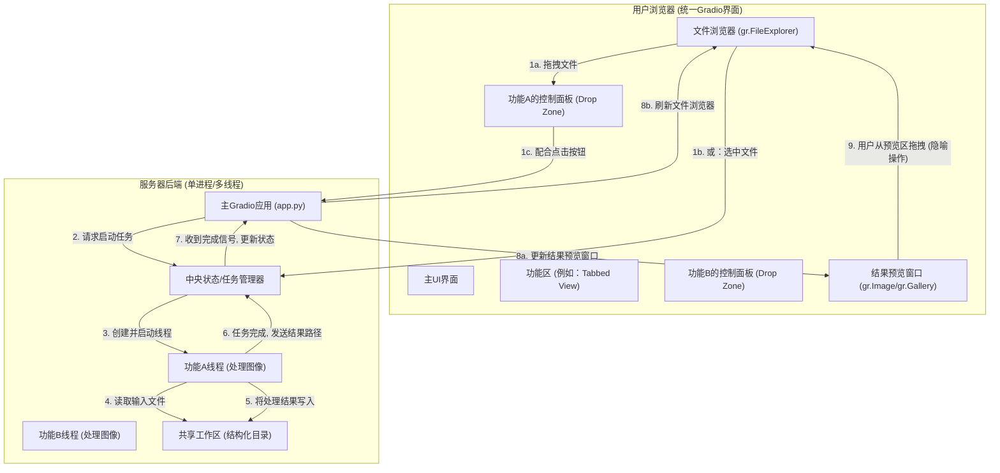

# 新版架构方案：线程化协作与拖拽式工作流

## 1. 核心思想转变

-   **从“跨进程通信”到“进程内通信”**：所有功能模块（原`iframe`）现在是主UI进程下的线程。通信不再需要文件系统作为中介，而是通过直接的函数调用、回调和Python内部的队列/状态管理器来完成，这会**更快、更可靠**。
-   **从“信号文件”到“直接回调”**：UI的刷新（如文件树）不再依赖于监听`.done`文件。当一个功能线程完成任务后，它会直接调用一个主进程中的函数（回调）来触发UI更新。这实现了真正的**即时响应**。
-   **从“URL传参”到“状态管理”**：数据（如待处理的文件路径）的传递不再通过URL查询参数，而是通过一个集中的Python后端状态管理器。

## 2. 新版架构设计

## 3. 核心交互流程详解

### **上传 (启动处理)**

您定义了两种方式：

1.  **拖拽上传**：
    -   **实现**：将每个功能的控制面板（例如一个`gr.Image`或`gr.Box`组件）设置为一个“放置区”（Drop Zone）。
    -   **流程**：用户从左侧的`文件浏览器`中拖动一个文件，直接“扔”到右侧某个功能的放置区上。Gradio的`.upload`或`.select`事件可以捕捉到这个动作和文件信息，从而触发后端逻辑。

2.  **选择并点击**：
    -   **实现**：这是传统交互。
    -   **流程**：用户在`文件浏览器`中点击选中一个文件，该选择被记录到后端的`中央状态管理器`中。然后，用户点击该功能对应的“开始处理”按钮，按钮的`.click()`事件从状态管理器中获取选中的文件并开始处理。

无论哪种方式，后端都会启动一个**功能线程**来执行耗时的图像处理任务，避免UI被阻塞。

### **下载 (保存结果)**

根据您的描述，“从工作区编辑结果预览窗拖到文件树框为下载”。

-   **技术解读**：这个操作在我们的新架构中是一个非常直观的**用户隐喻**。实际上，当功能线程完成处理后，它**已经将结果文件保存**在了服务器的`共享工作区`目录中。随后，主应用会**自动刷新**`文件浏览器`和`结果预览窗口`。
-   **实现**：用户看到结果出现在预览窗，同时也看到新文件/文件夹出现在文件树里。这个“拖拽”动作本身可以不做任何后端操作，因为它代表的“下载”/“保存”这个行为，系统已经自动完成了。这给了用户一个清晰的“任务完成”的心理确认。或者，我们可以赋予这个拖拽动作新的含义，例如“将此结果移动到另一个指定文件夹”。

## 4. 修订后的实施步骤

1.  **UI布局**：
    -   使用`gr.Tabs()`来组织四个功能，每个`Tab`页是一个独立的功能区。
    -   每个功能区内，设置一个用于拖拽交互的“放置区”和一个用于显示结果的`结果预览窗口`。

2.  **中央状态管理器**：
    -   创建一个简单的Python类或字典作为`g_state`。
    -   用于存储：当前在文件浏览器中选中的文件路径、各线程的运行状态、最新生成的结果路径等。

3.  **线程化改造**：
    -   将每个核心处理逻辑封装到一个函数中。
    -   当需要处理时，使用`threading.Thread(target=your_function, args=...)`来启动它。
    -   处理函数完成后，需要通过一个回调函数（例如，主应用传给它的一个`on_complete`函数）来通知主进程。

4.  **回调驱动的UI更新**：
    -   创建一个`update_ui_on_completion(result_path)`函数。
    -   当线程通过回调函数报告完成时，主进程调用`update_ui_on_completion`。
    -   此函数负责返回`gr.update(...)`来刷新`文件浏览器`和`结果预览窗口`。

5.  **保留结构化归档**：
    -   原有的**线性(1->1)**和**树形(1->N)**的文件保存规则依然非常有价值，应予以保留。它能让`共享工作区`的目录结构保持清晰、可追溯。唯一的区别是，不再需要创建`.done`信号文件。
