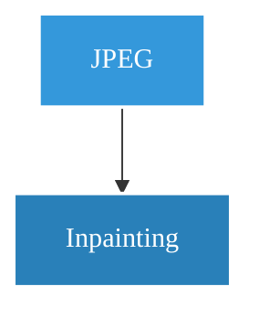

# Gradio 实时工作流树技术设计文档

## 1. 概述 (Overview)

本文档旨在为 Gradio 项目设计一个实时渲染的工作流树功能。该功能允许用户追踪和管理多步骤的图像编辑历史，提供节点选择、图像预览、继续编辑和删除历史分支等交互能力，以提升复杂编辑流程的可用性和可追溯性。

---

## 2. 数据结构 (Data Structure)

所有工作流状态将以 JSON 格式存储在 `workflow.json` 文件中。核心数据是一个包含所有节点的列表。

### 2.1. 节点对象 (Node Object)

每个节点都是一个 JSON 对象，包含以下字段：

- `id` (string, required): 节点的唯一标识符，建议使用 `uuid.uuid4()` 生成。
- `parent_id` (string | null, required): 父节点的 `id`。根节点的此字段为 `null`。
- `type` (string, required): 节点类型。
    - `"leaf"`: 叶子节点，代表一个原始文件或一个编辑流程的终点。
    - `"operation"`: 非叶子节点（或称操作节点），代表一次编辑操作的结果。
- `label` (string, required): 显示在节点框中的文本，如文件类型 "PNG" 或操作名称 "Inpainting"。
- `data` (object, required): 包含节点元数据的对象。
    - `file_path` (string, required): 节点关联的图像文件在服务器上的绝对或相对路径。
    - `file_type` (string, optional): 文件的 MIME 类型，如 `image/jpeg`。
    - `timestamp` (string, required): 节点创建时的时间戳 (ISO 8601 格式)。
    - `operation_params` (object, optional): **仅 `operation` 类型节点拥有此字段**。记录导致此节点产生的编辑操作所使用的具体参数，例如 `{ "prompt": "a cute cat", "scale": 4 }`。

### 2.2. JSON 结构示例

```json
{
  "nodes": [
    {
      "id": "a1b2c3d4-0001",
      "parent_id": null,
      "type": "leaf",
      "label": "JPEG",
      "data": {
        "file_path": "/workspace/uploads/original_image.jpg",
        "file_type": "image/jpeg",
        "timestamp": "2025-09-04T08:00:00Z"
      }
    },
    {
      "id": "a1b2c3d4-0002",
      "parent_id": "a1b2c3d4-0001",
      "type": "operation",
      "label": "Inpainting",
      "data": {
        "file_path": "/workspace/results/inpainted_image.png",
        "file_type": "image/png",
        "timestamp": "2025-09-04T08:05:00Z",
        "operation_params": {
          "mask_path": "/workspace/masks/mask_01.png",
          "prompt": "a cat on the sofa"
        }
      }
    }
  ],
  "metadata": {
    "version": "1.0",
    "last_saved": "2025-09-04T08:05:00Z"
  }
}
```

---

## 3. 前端实现 (Frontend Implementation)

### 3.1. UI 布局 (Gradio)

```python
import gradio as gr

with gr.Blocks() as demo:
    gr.Markdown("## 图像编辑工作流")
    with gr.Row():
        with gr.Column(scale=1):
            # 预览和操作区域
            preview_image = gr.Image(label="节点预览", interactive=False)
            edit_button = gr.Button("载入此图进行编辑")
            delete_button = gr.Button("删除选中节点及后续")
            # 隐藏的组件，用于JS和Python通信
            selected_node_id = gr.Textbox(label="Selected Node ID", visible=False)
        with gr.Column(scale=2):
            # 工作流树和上传区域
            workflow_tree_html = gr.HTML()
            upload_button = gr.UploadButton("上传新图像 (创建新工作流)")
```

### 3.2. 渲染引擎 (Mermaid.js)

我们将使用 Mermaid.js 在 `gr.HTML` 组件中渲染工作流树。

- **动态生成**: 后端 Python 代码将读取 `workflow.json`，遍历节点，并生成符合 Mermaid `graph` 语法的字符串。
- **样式定制**: 使用 `classDef` 定义节点样式，以满足“蓝色背景、白色文字、白色边框”的手绘风格需求。
- **交互绑定**: 使用 `click` 关键字为每个 Mermaid 节点绑定一个 JavaScript 回调函数 `handleNodeClick`，并将节点的 `id` 作为参数传入。

**Mermaid 语法生成示例:**



### 3.3. 核心交互 (JavaScript)

一个全局的 JavaScript 函数将被注入到 `gr.HTML` 中，用于处理节点点击事件。

```javascript
function handleNodeClick(nodeId) {
    // 1. 找到隐藏的 Gradio Textbox 组件
    // Gradio 会将组件的 label 转换为 DOM 元素的 ID 或 class，需要检查确认
    const hidden_textbox = document.querySelector('#selected_node_id textarea'); // 选择器可能需要微调
    
    // 2. 设置 Textbox 的值
    hidden_textbox.value = nodeId;
    
    // 3. 触发 'change' 事件，Gradio 会监听到这个变化并通知后端
    const event = new Event('change', { bubbles: true });
    hidden_textbox.dispatchEvent(event);

    console.log("Selected node: " + nodeId);
}
```

---

## 4. 后端实现 (Backend Implementation)

### 4.1. `WorkflowManager` 类 API

一个 Python 类用于封装所有与工作流相关的业务逻辑。

```python
# workflow_manager.py

import json
import uuid
from datetime import datetime

class WorkflowManager:
    def __init__(self, filepath="workflow.json"):
        """初始化管理器，加载现有工作流或创建新的。"""
        self.filepath = filepath
        self.nodes = []
        self.load()

    def load(self):
        """从 JSON 文件加载节点数据。"""
        # ... 实现文件读取和解析 ...

    def save(self):
        """将当前节点数据保存到 JSON 文件。"""
        # ... 实现文件写入 ...

    def get_node(self, node_id):
        """根据 ID 查找并返回节点对象。"""
        # ... 实现节点查找 ...

    def add_root_node(self, image_path, file_type):
        """
        添加一个新的根节点 (当用户上传新图片时)。
        返回: 新创建的节点 ID。
        """
        # ... 实现创建根节点逻辑 ...

    def add_child_node(self, parent_id, operation_name, output_image_path, params={}):
        """
        在指定父节点下添加一个新的子节点 (当一次编辑操作完成时)。
        同时，如果父节点是 leaf，则将其类型转换为 operation。
        返回: 新创建的节点 ID。
        """
        # ... 实现创建子节点和父节点类型转换逻辑 ...

    def delete_subtree(self, node_id):
        """
        删除以指定节点为根的整个子树。
        如果删除后，父节点不再有任何子节点，则将其类型从 'operation' 退化为 'leaf'。
        """
        # ... 实现递归删除和父节点退化逻辑 ...

    def get_image_path(self, node_id):
        """获取指定节点关联的图像路径。"""
        node = self.get_node(node_id)
        return node['data']['file_path'] if node else None

    def to_mermaid(self):
        """将当前工作流数据转换为 Mermaid.js 格式的字符串。"""
        # ... 实现 Mermaid 文本生成逻辑 ...
```

### 4.2. Gradio 事件监听

在主应用脚本中，实例化 `WorkflowManager` 并将 Gradio 组件的事件与管理器的方法连接起来。

```python
# app.py
import gradio as gr
from workflow_manager import WorkflowManager

wm = WorkflowManager()

def on_select_node(node_id):
    # 当 JS 将节点 ID 发送回来时触发
    if not node_id:
        return gr.update() # 无效ID，不更新
    
    image_path = wm.get_image_path(node_id)
    # 返回更新预览图的指令
    return gr.update(value=image_path)

def on_upload(file):
    # 上传新图片
    new_node_id = wm.add_root_node(file.name, file.type)
    wm.save()
    # 返回更新工作流树的指令
    return gr.update(value=wm.to_mermaid())

# ... 其他事件监听函数 (on_delete, on_edit) ...

# 绑定事件
selected_node_id.change(fn=on_select_node, inputs=selected_node_id, outputs=preview_image)
upload_button.upload(fn=on_upload, inputs=upload_button, outputs=workflow_tree_html)
```

---

## 5. 核心功能流程

- **创建根节点**: `User -> gr.UploadButton -> on_upload() -> wm.add_root_node() -> wm.save() -> wm.to_mermaid() -> gr.HTML update`
- **选中与预览**: `User -> Clicks Mermaid Node -> handleNodeClick(id) -> gr.Textbox.change() -> on_select_node(id) -> wm.get_image_path() -> gr.Image update`
- **删除节点**: `User -> gr.Button -> on_delete() -> wm.delete_subtree() -> wm.save() -> wm.to_mermaid() -> gr.HTML update`

---

## 6. 系统交互图

```mermaid
graph LR
    subgraph Browser (Frontend)
        direction TB
        User -- 1. Upload Image --> UploadBtn[gr.UploadButton]
        User -- 6. Click Node --> Tree[gr.HTML - Mermaid]
    end

    subgraph Server (Backend)
        direction TB
        GradioApp[Gradio App]
        WM[WorkflowManager]
        JSON[workflow.json]

        UploadBtn -- 2. Event --> GradioApp
        GradioApp -- 3. on_upload(file) --> WM
        WM -- 4. add_root_node() --> JSON
        GradioApp -- 5. Update Tree --> Tree
        
        Tree -- 7. handleNodeClick(nodeId) --> GradioApp
        GradioApp -- 8. on_select_node(nodeId) --> WM
        WM -- 9. get_image_path() --> GradioApp
        GradioApp -- 10. Update Preview --> User
    end
```

---

## 7. 实施步骤

1.  **环境搭建**: 创建 Gradio 基础 UI 布局，包含所有必需的组件。
2.  **后端基础**: 实现 `WorkflowManager` 类，完成 `load`, `save`, `get_node` 和 `to_mermaid` (初始版本)。
3.  **根节点创建**: 实现 `upload_button` 的 `upload` 事件，调用 `add_root_node` 并刷新工作流树。
4.  **节点预览**: 实现 JS-Python 通信 (`handleNodeClick` 和 `selected_node_id.change`)，完成节点选中后的图像预览功能。
5.  **“保存至工作区”集成**: 在各编辑子页面中，实现保存按钮逻辑，调用 `add_child_node` 并刷新工作流树。
6.  **“编辑”功能集成**: 实现“载入编辑”按钮逻辑，获取选中节点的图像并将其发送到对应的编辑子页面。
7.  **删除功能**: 实现删除按钮逻辑，调用 `delete_subtree` 并刷新工作流树。
8.  **测试与优化**: 对所有功能进行完整测试，修复 bug，并根据需要添加约束（如禁止编辑非叶子节点）。