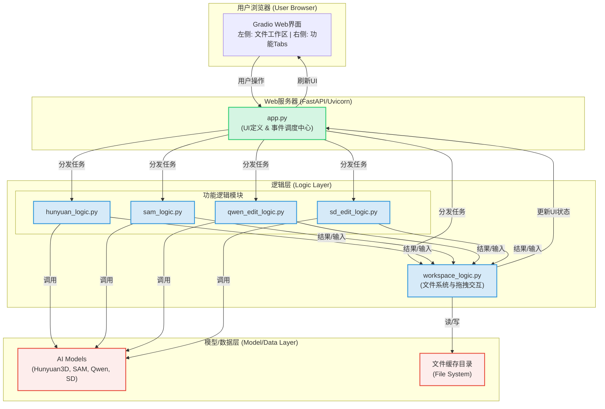
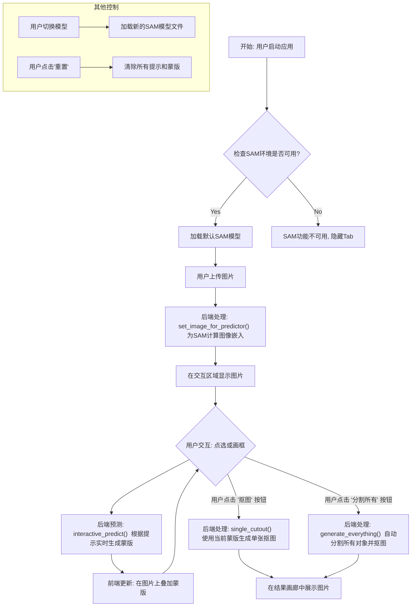
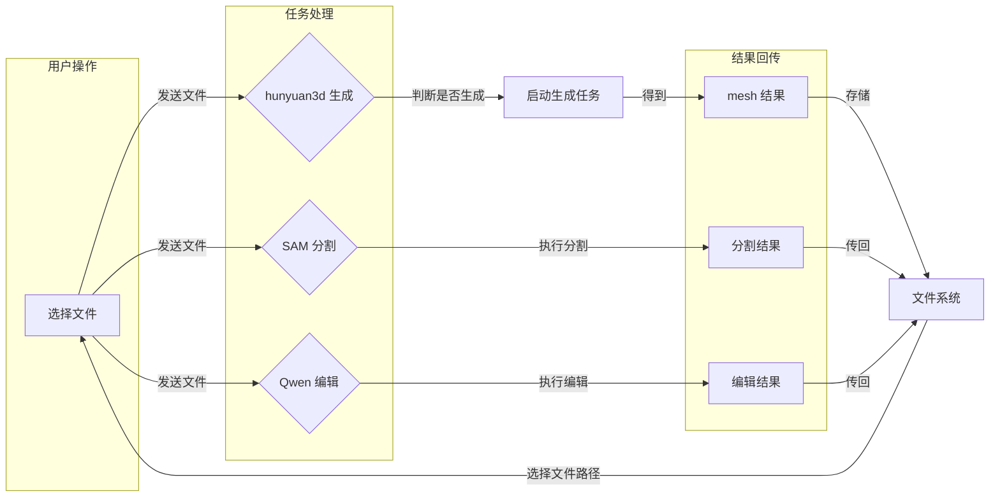
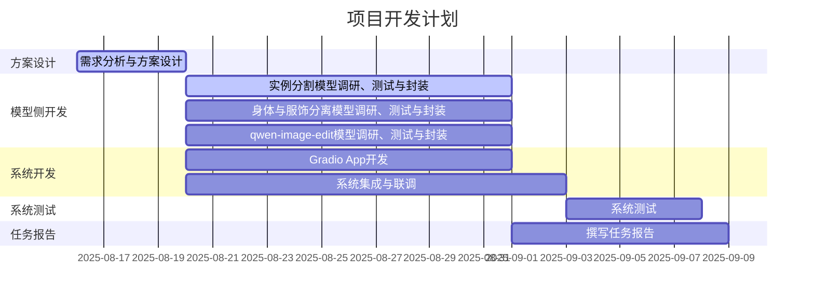

## 概要
1. 更新了系统的UI和框架设计。
2. 已经将混元生成功能、SAM分割功能、Qwen-Image-Edit功能初步集成起来。
3. 衣物和人体分开生成：经测试，visual try-on领域的模型面向真实世界训练，对Anime 3D 模型风格效果不理想。现在考虑从AI图生图角度（InPainting）着手，例如stable diffusion结合ControlNet。
4. 通过comfyUI部署Qwen-Image-Edit模型，并为前端提供Json形式的API。
5. 构建了一个用于测试的小规模图像数据集。
## 1.开发方面工作
### 1.1.UI和框架设计更新
本系统旨在实现一种可交互的、针对图像局部区域的2D内容编辑和3D内容生成方案。
核心技术路线为“**图像编辑 + 条件化3D生成**”。用户通过Web界面上传图片，然后可以使用多种方式进行编辑（交互式实例分割、角色的身体和服饰分离（InPainting）、文本驱动的细粒度编辑），最后将结果图像作为关键条件，驱动混元3D模型生成高质量的3D资产。
> 

如图所示，左侧为文件和文件树预览区，以文件树的形式保存和组织中间结果，展现工作流，点击文件树上的节点，可以预览。
右侧为工作区，通过功能导航栏切换编辑功能。各个编辑功能都是独立的子线程，可并行工作。
通过拖拽实现数据交互：从文件树向工作区拖动，上传待编辑文件；从工作区向文件树拖动，缓存编辑结果。

下图为我们设计的Gradio应用框架。

### 1.2.集成SAM编辑功能

---

#### 1. 启动与初始化

*   **环境检查**：应用启动后，程序首先会检查本地环境中是否成功安装了SAM所需的相关库 (`segment-anything`)。
*   **模型预加载**：如果环境可用，系统会自动加载一个默认的SAM模型文件（例如：`sam_vit_h_*.pth`）。这一步是为了避免用户在第一次使用时需要等待漫长的模型加载时间，从而优化了用户体验。如果环境不可用，SAM相关的功能界面将被隐藏。

#### 2. 图片上传与准备

*   **用户上传**：流程始于用户在Web界面的“Image Prompt”选项卡中上传一张图片。
*   **后端处理与嵌入计算**：
    *   图片上传后，会触发后端的 `set_image_for_predictor()` 函数。
    *   该函数的核心任务是调用SAM的 `predictor.set_image()` 方法。此方法会执行一个关键的预处理步骤：为上传的图片计算**“图像嵌入” (Image Embeddings)**。
    *   这个嵌入可以被理解为模型对图像内容的高度浓缩的特征表示。它是一个计算成本较高的操作，但**只需在更换图片时执行一次**。
*   **界面更新**：计算完成后，用户上传的图片会被显示在“SAM Segmentation”选项卡的交互式显示区域，等待后续操作。

#### 3. 交互式分割 (核心循环)

这是整个功能最具交互性的部分，形成一个快速反馈的闭环。

*   **用户提供提示 (Prompt)**：用户在交互式显示区域，通过点击（添加点）或拖拽（画框）的方式，向模型提供分割目标的提示信息。
*   **实时预测**：
    *   用户的每一次交互（例如，一次点击）都会触发后端的 `interactive_predict()` 函数。
    *   该函数会利用上一步**预先计算好的“图像嵌入”**和用户当前提供的**所有提示**（点和框），调用 `predictor.predict()` 方法。
    *   由于图像嵌入被复用，模型的预测过程变得非常迅速，几乎可以达到实时响应。
*   **视觉反馈**：模型预测生成的蒙版（Mask）会立刻被发送回前端，并叠加显示在图片上。用户可以立即看到自己操作带来的分割结果。
*   **循环优化**：用户可以不断地添加新的提示点或框，来修正和优化不满意的分割区域，每次操作都会触发一次新的快速预测和界面更新，直到获得满意的分割蒙版为止。

#### 4. 生成最终结果

当用户对实时预览的蒙版感到满意后，可以选择以下操作来生成最终的产出：

*   **单目标抠图 (`single_cutout`)**：
    *   用户点击“抠图”按钮。
    *   后端会利用当前交互生成的蒙版，将对应的物体从原始图像中分离出来，创建一个背景透明的PNG图像。
*   **全图自动分割 (`generate_everything`)**：
    *   用户点击“分割所有物体”按钮。
    *   后端会使用SAM的`SamAutomaticMaskGenerator`模式，该模式会自动检测并分割图像中所有可识别的对象，并为每个对象生成一个独立的抠图。
*   **结果展示**：所有生成的抠图结果最终都会被展示在下方的“抠图结果”区域中，方便用户预览和下载。

#### 5. 辅助控制功能
为了提升灵活性和可用性，系统还提供了额外的控制选项：

*   **模型切换**：用户可以通过下拉菜单选择并加载本地`models`文件夹中存放的任何其他SAM模型文件（例如不同大小的ViT-B, ViT-L, ViT-H模型）。
*   **重置操作**：用户可以点击“重置”按钮，该操作会清空当前所有的交互提示（点和框）以及生成的蒙版，将交互界面恢复到刚上传完图片的初始状态。
### 1.3.和其他功能并行的混元生成功能

#### *核心需求*：
为提升用户体验，优化图像生成流程中的等待时间，我们引入了混元生成功能。该功能的核心需求是：当用户发起图像生成请求时，由于生成过程耗时较长，系统应允许用户在此期间并行执行其他图像编辑任务，例如 SAM 分割、Qwen 图像编辑等，从而有效利用等待时间，避免用户空闲。
#### *主要实现*：
- 统一通信协议：我们定义了一套标准化的数据传输格式和 API 接口。所有应用模块，包括混元生成、SAM 分割和 Qwen 编辑，都将遵循此协议与图像文件系统进行通信。这确保了不同任务之间的数据流能够顺畅、高效地共享，消除了兼容性问题。
- 并行任务处理：当用户发起混元生成请求时，系统会立即返回一个任务 ID，以创建子HTML进程的形式在后台启动生成任务。前端界面不再阻塞，用户可以继续进行其他操作。
- 状态监控与事件通知：系统会实时监控混元生成任务的进度。当任务完成或状态发生变化时，会通过事件通知机制告知前端界面。同时，用户可以随时通过任务 ID 查询生成任务的当前状态，并在任务完成后自动加载结果。

#### *展示实例*：
可以实现Hunyuan3D生成的期间进行编辑，各个组件之间能够并行进行

### 1.4.Qwen-Image-Edit功能
#### 1.4.1.ComfyUI后端
通过Linux版本Comfy UI部署量化版的Qwen-Image-Edit，导出其提供的Json API。
> 
通过静态HTML，验证了API的可用性。
> 

#### 1.4.2.Gradio前端
前端交互层 (Gradio UI)
- 界面构建: 使用 `gradio` 库搭建了一个简洁的用户界面，分为左右两栏。左侧为输入区（图片上传、文本指令框），右侧为输出区（结果图片、状态/进度显示、版本历史导航器）。
- 状态管理: 通过 `gr.State` 在浏览器会话中维持了两个关键状态：`history_state` (一个列表，存储从原图到每一个编辑版本的所有图片对象) 和 `current_index_state` (一个整数，指向当前正在查看的版本在列表中的位置)。
- 事件驱动: 整个应用是事件驱动的。用户的每一个操作（上传图片、点击按钮、选择版本）都会触发一个绑定好的后端Python函数，并以流式（Streaming）的方式将结果更新回界面，实现了动态交互。
  目前的UI界面设计如下

外部服务通信层 (ComfyUI API & WebSocket)
- HTTP API通信: 代码通过 `requests` 库调用ComfyUI的三个核心HTTP API：
    * `/upload/image`: 用于上传作为编辑基础的图片。
    * `/prompt`: 用于提交包含完整节点和参数的JSON工作流，将任务加入队列。
    * `/view`: 用于在任务完成后下载生成的图片。
- WebSocket实时监控: 通过 `websockets` 库连接到ComfyUI的 `/ws` 端点。一旦任务开始执行，ComfyUI服务器会通过这条长连接主动推送实时的进度信息（例如 `progress: 5/20`），后端接收到后立即转发给前端，实现了状态和耗时的秒级更新。

后续完善
- 目前前后端联调工作尚未开始，前端历史版本管理等功能尚未验证
- 还未将qwen界面集成进入主界面
  
### 1.5.文件系统

目前进度
- 在gradio的主页面中添加了一个File_Explorer组件，用来展示data/文件夹下的内容
- 加入了对File_Explorer组件选中文件的下载、删除、加载操作，支持文件多选批量处理

后续完善
- 加入sam，hunyuan以及qwen保存文件到data文件夹下的逻辑
- 删除文件现在不能自动重新渲染UI，需要手动刷新，尝试使用gr.update或者直接返回一个新的gradio File_Explorer component的方式重新渲染

预期目标
- 利用文件系统组件作为中转站，和sam、hunyuan、qwen-edit等组件交互，实现数据流的无缝衔接
- 利用文件系统的可视化以及批量处理功能便捷地管理用户编辑过程中的中间结果、素材以及得到的3D资产

### 1.6.现阶段成果演示
<video controls src="video-3.mp4" title="Title"></video>
## 2.模型方面工作
### 2.1.衣物和人体分离功能

为实现在角色图像中分离衣物与人体，我们系统性地测试了**虚拟试穿（Visual Try-on）** 领域的相关模型。本部分将汇报测试结论、分析瓶颈，并阐述我们提出的新解决方案。

#### 2.1.1. Visual Try-on 模型测试与瓶颈

我们重点测试了基于**人体解析（Human Parsing）** 的模型，其中 **SCHP (Self-Correction for Human Parsing)** 模型是一个代表性工作。该模型在ATR数据集上进行了训练，其性能指标（mIoU: 82.29%）表明其在真实人像的服饰解析任务上表现优异。

**测试结果：**
经过对我们的测试图像集（主要为动漫风格角色）进行验证，我们发现该模型的应用效果**并不理想**，无法满足后续生成需求。

**具体瓶颈分析：**
1.  **领域差异（Domain Gap）**：SCHP等模型均在**真实世界人像照片数据集（如ATR）** 上训练。其学习的服饰特征、纹理、人体比例和画风与**动漫3D模型风格（Anime 3D）** 存在巨大差异，导致模型无法正确理解动漫图像的语义构成。
2.  **分割结果不完整**：在动漫图像上，模型预测的解析图会出现**大面积的预测空缺** 和**边缘模糊不清** 的问题。例如，模型可能无法将动漫中常见的复杂发型、飘逸的裙摆或特定装饰品准确归类到其预定义的18个标签中，导致生成的掩码无法用于精准分离衣物。
3.  **输出局限性**：如前所述，此类模型的输出仅为**标签图（Parse Map）**，并非像素级衣物图像。若要获取分离的衣物，仍需复杂的后处理流程，而基于不准确标签图的后处理结果可靠性低。
> 
> 

**结论**：直接迁移使用面向真实世界的Visual Try-on模型来解决动漫风格图像的分离任务，是一条难以走通的技术路线。

#### 2.1.2. 新思路：基于图像修复（InPainting）的解决方案

针对上述瓶颈，我们提出了新的技术方向：**绕过复杂的“分离”步骤，直接通过“生成”来解决**。即，利用强大的**文本引导图像修复（Text-Guided Inpainting）** 技术，在原有角色基础上直接生成所需的新衣物。

**核心技术栈：Stable Diffusion + ControlNet**

*   **Stable Diffusion (Inpainting)**: 强大的文本生成图像模型，其修复版本能根据文本提示和图像蒙版，在指定区域内生成全新的、符合上下文语义的内容。
*   **ControlNet**: 用于精确控制生成过程的关键技术。通过提取原图的**姿态（OpenPose）** 或**边缘轮廓（Canny）** 信息，并将其作为生成条件，可以确保新生成的衣物**完美贴合角色的原有姿势和身体形态**，避免人物形体发生畸变。

**工作流程：**
1.  **蒙版创建**：用户通过简单的涂鸦或借助SAM，在原始图像上勾勒出想要更换衣物的区域（如整个上衣区域）。
2.  **条件提取**：自动使用ControlNet从原图提取姿态或边缘信息。
3.  **文本引导生成**：用户输入描述目标衣物的文本提示（如：“一件黑色的皮质夹克”）。AI将仅在蒙版区域内，依据文本提示和ControlNet的形体约束，生成新的衣物，并与原图无缝融合。

此方案将作为我们下一阶段实现衣物编辑与分离功能的核心技术路径。
### 2.2.测试图像数据集
黄耀祖
展现一下已经找到的图像，介绍收集数据时的侧重点、途径啥的。
找一些典型的图像，展现分割、qwen编辑、3D生成结果。
## 3.本周分工
自行填写

| 负责人 | 任务                          |
| --- | --------------------------- |
| 杜斌  | UI和框架设计、Qwen-Image-Edit API |
| 党浩川 |集成了SAM模型组件；完成SAM分割模块的集成和测试并解决sam分割遇到的问题 |                             |
| 刘文博 | 加入了文件树的组件，进行文件的可视化和管理                             |
| 王雯睿 | 衣物和人体分离功能           |
| 葛俊辰 | 统一了SAM、hunyuan生成和文件系统的通信方式，实现生成和编辑的同步进行；完成hunyuan3D生成模块的集成和测试 |
| 罗雅淇 | 完成Qwen-Image-Edit 基于gradio的UI界面开发  |
| 黄耀祖 |                             |
| 所有人 | 本周报告                        |

### 3.2 日程安排
无变化，正常推进。

## 4.下周工作安排
开发侧：
1. 集成人体和衣物分离功能。
2. 各个模型的后端处理并发请求。
3. 通过拖拽完成文件交互。
4. 系统优化、完善。
5. 项目报告中的开发部分。

模型侧：
1. 起草项目报告大纲。
2. 项目报告中的模型部分。
3. 系统测试及测试报告。
