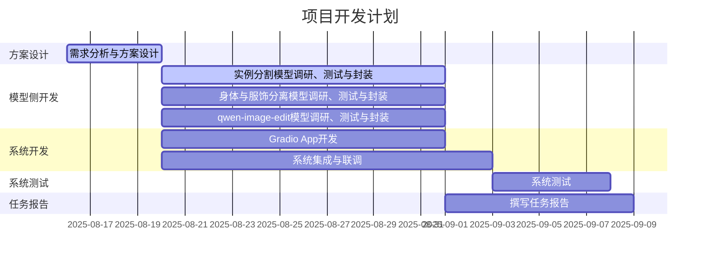

## 概要
1. 更新了系统的UI和框架设计。
2. 已经将混元生成功能、SAM分割功能、Qwen-Image-Edit功能初步集成起来。
3. 衣物和人体分开生成：经测试，visual try-on领域的模型面向真实世界训练，对Anime 3D 模型风格效果不理想。现在考虑从AI图生图角度（InPainting）着手，例如stable diffusion结合ControlNet。
4. 通过comfyUI部署Qwen-Image-Edit模型，并为前端提供Json形式的API。
5. 构建了一个用于测试的小规模图像数据集。
## 1.开发方面工作
### 1.1.UI和框架设计更新
本系统旨在实现一种可交互的、针对图像局部区域的2D内容编辑和3D内容生成方案。
核心技术路线为“**图像编辑 + 条件化3D生成**”。用户通过Web界面上传图片，然后可以使用多种方式进行编辑（交互式实例分割、角色的身体和服饰分离（InPainting）、文本驱动的细粒度编辑），最后将结果图像作为关键条件，驱动混元3D模型生成高质量的3D资产。
> 

如图所示，左侧为文件和文件树预览区，以文件树的形式保存和组织中间结果，展现工作流，点击文件树上的节点，可以预览。
右侧为工作区，通过功能导航栏切换编辑功能。各个编辑功能都是独立的子线程，可并行工作。
通过拖拽实现数据交互：从文件树向工作区拖动，上传待编辑文件；从工作区向文件树拖动，缓存编辑结果。
### 1.2.框架搭建、集成SAM编辑功能
党浩川。标题名字可以改一下
### 1.3.混元生成功能
葛俊辰。
### 1.4.Qwen-Image-Edit功能
#### 1.4.1.ComfyUI后端
通过Linux版本Comfy UI部署量化版的Qwen-Image-Edit，导出其提供的Json API。
> 
通过静态HTML，验证了API的可用性。
> 

#### 1.4.2.Gradio前端
罗雅淇。
### 1.5.文件系统
刘文博
### 1.6.现阶段成果演示
党浩川
## 2.模型方面工作
### 2.1.衣物和人体分离功能
王雯睿
visual try-on模型的测试、瓶颈
基于AI图生图（InPainting）的新思路
### 2.2.测试图像数据集
黄耀祖
展现一下已经找到的图像，介绍收集数据时的侧重点、途径啥的。
找一些典型的图像，展现分割、qwen编辑、3D生成结果。
## 3.本周分工
自行填写

| 负责人 | 任务                          |
| --- | --------------------------- |
| 杜斌  | UI和框架设计、Qwen-Image-Edit API |
| 党浩川 |                             |
| 刘文博 |                             |
| 王雯睿 |                             |
| 葛俊辰 |                             |
| 罗雅淇 |                             |
| 黄耀祖 |                             |
| 所有人 | 本周报告                        |

### 3.2 日程安排
无变化，正常推进。

## 4.下周工作安排
开发侧：
1. 集成人体和衣物分离功能。
2. 各个模型的后端处理并发请求。
3. 通过拖拽完成文件交互。
4. 系统优化、完善。
5. 项目报告中的开发部分。

模型侧：
1. 起草项目报告大纲。
2. 项目报告中的模型部分。
3. 系统测试及测试报告。