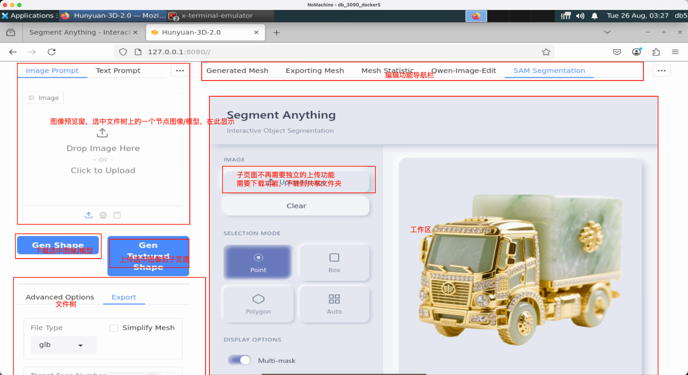
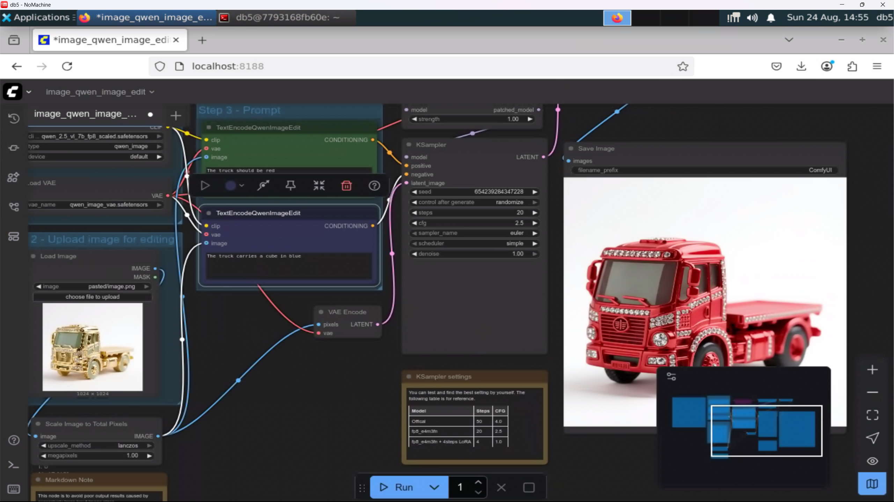
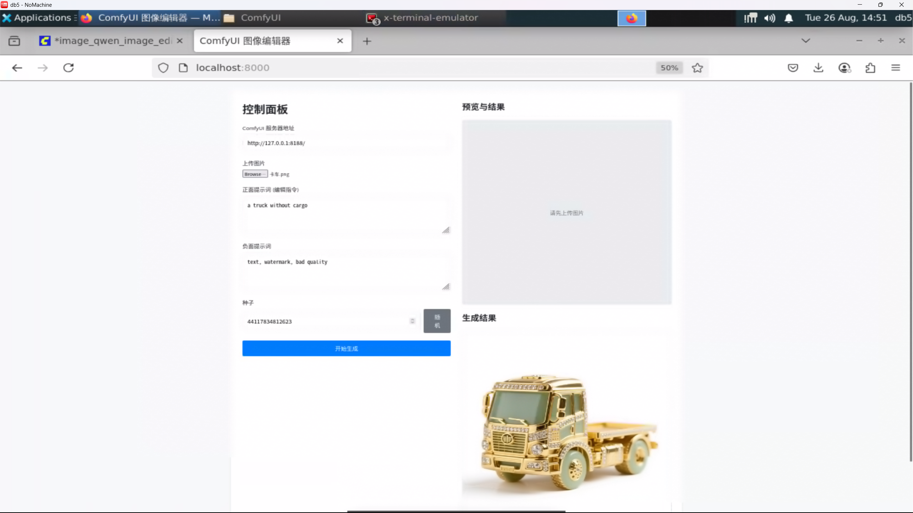
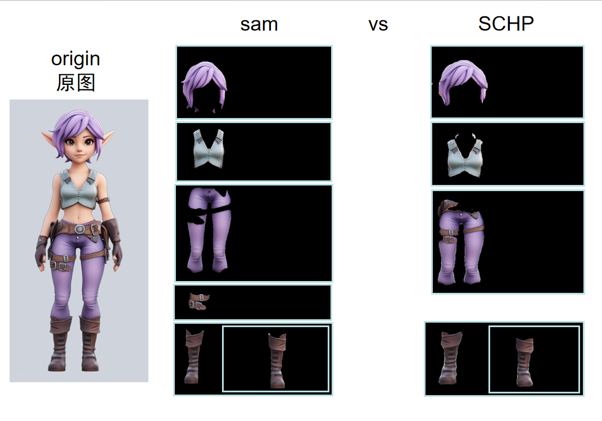
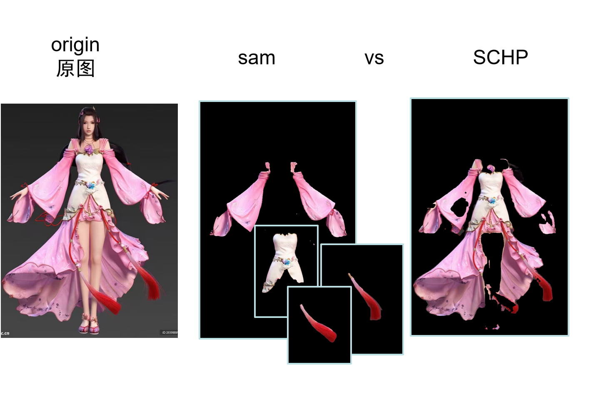
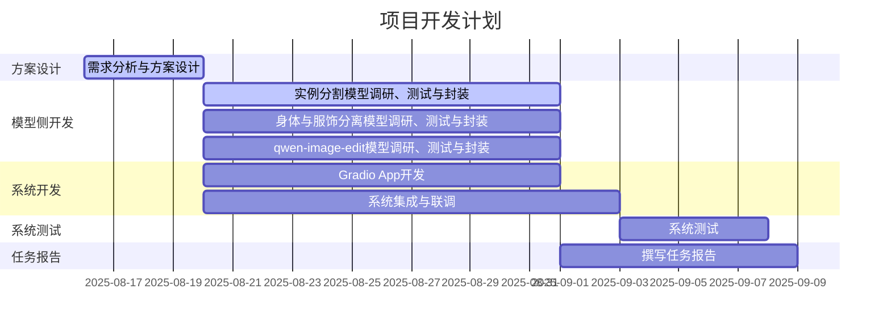

## 概要
1. 更新了系统的UI和框架设计。
2. 已经将混元生成功能、SAM分割功能、Qwen-Image-Edit功能初步集成起来。
3. 衣物和人体分开生成：经测试，visual try-on领域的模型面向真实世界训练，对Anime 3D 模型风格效果不理想。现在考虑从AI图生图角度（InPainting）着手，例如stable diffusion结合ControlNet。
4. 通过comfyUI部署Qwen-Image-Edit模型，并为前端提供Json形式的API。
5. 构建了一个用于测试的小规模图像数据集。
## 1.开发方面工作
### 1.1.UI和框架设计更新
本系统旨在实现一种可交互的、针对图像局部区域的2D内容编辑和3D内容生成方案。
核心技术路线为“**图像编辑 + 条件化3D生成**”。用户通过Web界面上传图片，然后可以使用多种方式进行编辑（交互式实例分割、角色的身体和服饰分离（InPainting）、文本驱动的细粒度编辑），最后将结果图像作为关键条件，驱动混元3D模型生成高质量的3D资产。
> 

如图所示，左侧为文件和文件树预览区，以文件树的形式保存和组织中间结果，展现工作流，点击文件树上的节点，可以预览。
右侧为工作区，通过功能导航栏切换编辑功能。各个编辑功能都是独立的子线程，可并行工作。
通过拖拽实现数据交互：从文件树向工作区拖动，上传待编辑文件；从工作区向文件树拖动，缓存编辑结果。
### 1.2.框架搭建、集成SAM编辑功能
党浩川。标题名字可以改一下
### 1.3.混元生成功能
葛俊辰。
### 1.4.Qwen-Image-Edit功能
#### 1.4.1.ComfyUI后端
通过Linux版本Comfy UI部署量化版的Qwen-Image-Edit，导出其提供的Json API。
> 
通过静态HTML，验证了API的可用性。
> 

#### 1.4.2.Gradio前端
罗雅淇。
### 1.5.文件系统
刘文博
### 1.6.现阶段成果演示
党浩川
## 2.模型方面工作
### 2.1.衣物和人体分离功能
### 2.1. 衣物和人体分离功能

为实现在角色图像中分离衣物与人体，我们系统性地测试了**虚拟试穿（Visual Try-on）** 领域的相关模型。本部分将汇报测试结论、分析瓶颈，并阐述我们提出的新解决方案。

#### 2.1.1. Visual Try-on 模型测试与瓶颈

我们重点测试了基于**人体解析（Human Parsing）** 的模型，其中 **SCHP (Self-Correction for Human Parsing)** 模型是一个代表性工作。该模型在ATR数据集上进行了训练，其性能指标（mIoU: 82.29%）表明其在真实人像的服饰解析任务上表现优异。

**测试结果：**
经过对我们的测试图像集（主要为动漫风格角色）进行验证，我们发现该模型的应用效果**并不理想**，无法满足后续生成需求。

**具体瓶颈分析：**
1.  **领域差异（Domain Gap）**：SCHP等模型均在**真实世界人像照片数据集（如ATR）** 上训练。其学习的服饰特征、纹理、人体比例和画风与**动漫3D模型风格（Anime 3D）** 存在巨大差异，导致模型无法正确理解动漫图像的语义构成。
2.  **分割结果不完整**：在动漫图像上，模型预测的解析图会出现**大面积的预测空缺** 和**边缘模糊不清** 的问题。例如，模型可能无法将动漫中常见的复杂发型、飘逸的裙摆或特定装饰品准确归类到其预定义的18个标签中，导致生成的掩码无法用于精准分离衣物。
3.  **输出局限性**：如前所述，此类模型的输出仅为**标签图（Parse Map）**，并非像素级衣物图像。若要获取分离的衣物，仍需复杂的后处理流程，而基于不准确标签图的后处理结果可靠性低。
> 
> 
**结论**：直接迁移使用面向真实世界的Visual Try-on模型来解决动漫风格图像的分离任务，是一条难以走通的技术路线。

#### 2.1.2. 新思路：基于图像修复（InPainting）的解决方案

针对上述瓶颈，我们提出了新的技术方向：**绕过复杂的“分离”步骤，直接通过“生成”来解决**。即，利用强大的**文本引导图像修复（Text-Guided Inpainting）** 技术，在原有角色基础上直接生成所需的新衣物。

**核心技术栈：Stable Diffusion + ControlNet**

*   **Stable Diffusion (Inpainting)**: 强大的文本生成图像模型，其修复版本能根据文本提示和图像蒙版，在指定区域内生成全新的、符合上下文语义的内容。
*   **ControlNet**: 用于精确控制生成过程的关键技术。通过提取原图的**姿态（OpenPose）** 或**边缘轮廓（Canny）** 信息，并将其作为生成条件，可以确保新生成的衣物**完美贴合角色的原有姿势和身体形态**，避免人物形体发生畸变。

**工作流程：**
1.  **蒙版创建**：用户通过简单的涂鸦或借助SAM，在原始图像上勾勒出想要更换衣物的区域（如整个上衣区域）。
2.  **条件提取**：自动使用ControlNet从原图提取姿态或边缘信息。
3.  **文本引导生成**：用户输入描述目标衣物的文本提示（如：“一件黑色的皮质夹克”）。AI将仅在蒙版区域内，依据文本提示和ControlNet的形体约束，生成新的衣物，并与原图无缝融合。

此方案将作为我们下一阶段实现衣物编辑与分离功能的核心技术路径。
### 2.2.测试图像数据集
黄耀祖
展现一下已经找到的图像，介绍收集数据时的侧重点、途径啥的。
找一些典型的图像，展现分割、qwen编辑、3D生成结果。
## 3.本周分工
自行填写

| 负责人 | 任务                          |
| --- | --------------------------- |
| 杜斌  | UI和框架设计、Qwen-Image-Edit API |
| 党浩川 |                             |
| 刘文博 |                             |
| 王雯睿 |                             |
| 葛俊辰 |                             |
| 罗雅淇 |                             |
| 黄耀祖 |                             |
| 所有人 | 本周报告                        |

### 3.2 日程安排
无变化，正常推进。

## 4.下周工作安排
开发侧：
1. 集成人体和衣物分离功能。
2. 各个模型的后端处理并发请求。
3. 通过拖拽完成文件交互。
4. 系统优化、完善。
5. 项目报告中的开发部分。

模型侧：
1. 起草项目报告大纲。
2. 项目报告中的模型部分。
3. 系统测试及测试报告。
