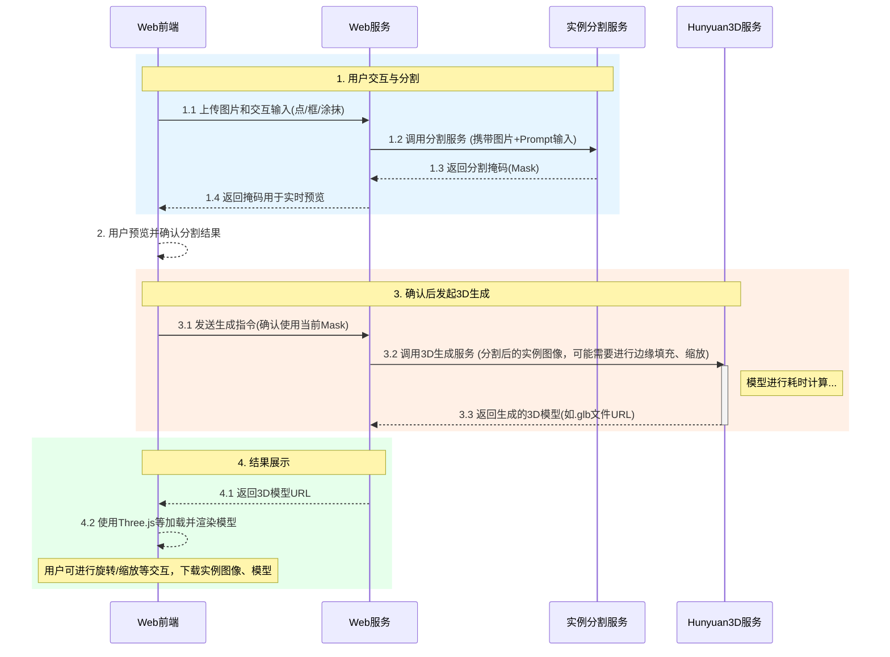
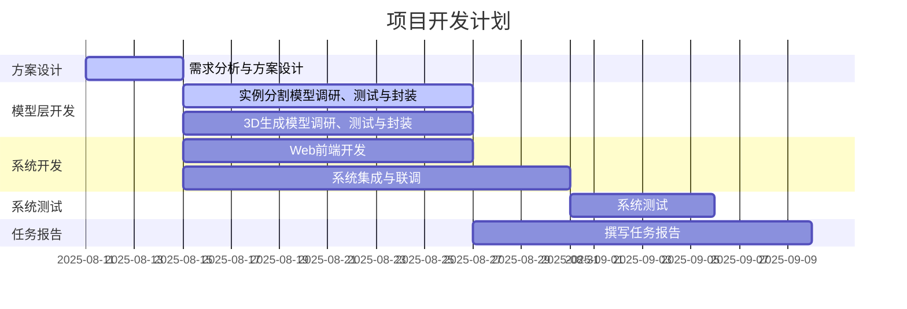

## 概要

## 章节一：任务思路概述

### 1.1 基本路线
本系统旨在实现一种可交互的、针对图像局部区域的3D内容生成方案。
核心技术路线为“**实例分割 + 条件化3D生成**”。用户通过友好的Web界面上传图片，并以交互方式（如点选、框选、涂抹）指定感兴趣的目标区域。系统首先调用实例分割模型，精确地从背景中分离出用户选定的目标。待用户确认分割结果后，系统将该分割后的实例图像作为关键条件，输入到Hunyuan3D生成模型中，驱动模型仅针对该选定区域生成高质量的3D资产。最终，生成的3D模型将在Web界面中进行渲染和展示，并提供基础的交互式浏览功能。

### 1.2 子进程功能
系统由以下三个核心子进程协同工作：
- **Web Server**:
    - **功能**: 作为用户交互的核心入口。负责接收用户上传的图片，处理用户的交互输入（点选、框选、涂鸦等），向实例分割模型发送分割请求，向用户实时反馈分割结果，在用户确认后向3D生成模型发送生成任务，并最终接收和展示生成的3D资产。
    - **技术栈选择**: Python (Flask/FastAPI) + JavaScript (React)。
- **实例分割模型服务**:
    - **功能**: 接收来自Web Server的图像和用户输入（prompt），执行实例分割算法，生成目标的精确掩码（Mask），并将结果返回给Web Server。
    - **模型选型**: SAM (Segment Anything Model) 或其变体，如FastSAM等。
- **Hunyuan3D生成模型服务**:
    - **功能**: 接收来自Web Server的实例图像，执行条件化的3D生成任务，并返回生成的3D资产（如.glb/.obj格式）。
    - **模型**: 腾讯混元3D大模型 (Hunyuan3D 2.1)。

### 1.3 系统协作机制
以下是系统各模块间协作的UML时序图：


## 1.4.调研重点
1. 系统的数据流：实例分割模型可接收的图片格式、尺寸；3D生成模型可接受的图片格式、尺寸、边缘填充方式；3D生成模型输出的3D资产格式。
2. 交互功能和界面设计，如何实现。
3. 进程间通信协议：message的格式、处理逻辑。
4. 目前拟基于SAM2的demo进行二次开发，通过github协作[SAM2](https://github.com/facebookresearch/sam2/tree/main/demo)
5. ***处理因遮挡导致的物体分割不全的问题。***
6. ***对于穿衣服的人，人体和衣物分别生成。***
7. 进阶：复杂功能和finetune模型。例如：
    1. 同时多次点击后区分部件再多个组件同时生成；
    2. 分开后的组件之间怎么保证不穿模
## 1.5.拟交付成果
1. 开发报告（CVPR格式，overleaf协作编辑）。
2. 容器化部署的服务。
## 章节二：实例分割模型调研

### 2.1 模型理论分析
- **最新实例分割模型介绍**:
    - SAM (Segment Anything Model): 原理、优势（零样本、Promptable）、局限性。
    - FastSAM: 针对SAM速度的改进，原理与性能权衡。
    - YOLOv8-seg: 在检测的同时进行分割，速度快，精度如何。
    - 其他SOTA模型...
- **评估指标体系**:
    - **mAP (mean Average Precision)**: 衡量检测和分割的综合精度。
    - **mIoU (mean Intersection over Union)**: 衡量分割掩码的准确度。
    - **FPS (Frames Per Second)**: 推理速度。
    - **模型大小 (Parameters)**: 部署资源消耗。
- **标称性能对比**:
    | 模型 | mAP (COCO) | mIoU (COCO) | FPS (V100) | 模型大小 |
    |---|---|---|---|---|
    | SAM (ViT-H) | - | - | ~5 | 2.5B |
    | FastSAM | | | | |
    | YOLOv8-seg-x | | | | |

### 2.2 模型实际分析
- **测试数据集准备**:
    - **通用数据集**: COCO, LVIS。
    - **垂类数据集**: 针对Hunyuan3D擅长生成的领域，如家具、车辆、卡通角色等，构建或搜集特定的小型测试集。
- **测试报告**:
    - 在上述数据集上，对候选模型的实际分割效果进行评测。
    - 分析不同模型在不同场景下的优劣（如小目标、复杂背景、边缘精度等）。
    - 记录实际的推理时间。

### 2.3 系统集成
- **模型部署方案**:
    - 使用ONNX/TensorRT进行模型优化和加速。
    - 采用Triton Inference Server或自定义Flask/FastAPI进行服务封装。
- **子进程封装**:
    - 使用Docker容器化部署，隔离环境，方便管理。
- **接口设计 (API)**:
    - **Endpoint**: `/segment`
    - **Method**: `POST`
    - **Request (JSON)**: `{"image": "base64_string", "prompt": {"type": "point", "coords": [x, y]}}`
    - **Response (JSON)**: `{"mask": "base64_string_of_mask_image", "status": "success"}`

## 章节三：3D生成模型调研（混元）

### 3.1 模型理论分析
- **最新文/图生3D模型介绍**:
    - **Hunyuan3D**: 技术原理（扩散模型、多视图一致性等），输入/输出格式，特点。
    - **Zero123/Zero123++**: 从单图生成新视角，可用于3D重建。
    - **Instant3D/LRM**: 其他主流的从单图快速生成3D的模型。
- **评估指标体系**:
    - **CLIP Score**: 生成物与文本提示的语义相关性。
    - **Chamfer Distance (CD)**, **Earth Mover's Distance (EMD)**: 衡量生成模型与真实模型间的几何相似度。
    - **渲染质量**: PBR材质、纹理清晰度、光照效果等主观评估。
- **标称性能对比**:
    | 模型 | 输入 | 输出 | 生成质量 | 生成速度 |
    |---|---|---|---|---|
    | Hunyuan3D 2.1 | 图+文 | 纹理网格 | 高 | 分钟级 |
    | Zero123++ | 图 | 新视角/3D | 中 | |
    | LRM | 图 | 纹理网格 | 高 | 秒级 |

### 3.2 模型实际分析
- **测试数据集准备**:
    - 与章节2.2对齐，使用垂类数据集的图像作为输入。
    - 准备对应的文本提示（Prompt）。
- **测试报告**:
    - 评估Hunyuan3D在给定图像和掩码条件下的生成效果。
    - 重点测试模型对局部区域生成的“专注度”和“融合度”。
    - 记录不同复杂度下的生成时间。

### 3.3 系统集成
- **模型部署方案**:
    - 遵循官方提供的部署指南。
    - 考虑API调用成本和配额。
- **子进程封装**:
    - 同样使用Docker容器化。
- **接口设计 (API)**:
    - **Endpoint**: `/generate3d`
    - **Method**: `POST`
    - **Request (JSON)**: `{"image": "base64", "mask": "base64", "text_prompt": "string"}`
    - **Response (JSON)**: `{"model_url": "url_to_glb_file", "status": "success"}`

## 章节四：Web设计和实现

- **蓝图**: 基于SAM2的demo进行二次开发，通过github协作[SAM2](https://github.com/facebookresearch/sam2/tree/main/demo)
- **实现功能**:
    1. **交互功能实现**：如何实现点选、框选、涂鸦等交互方式，并获取坐标信息传递给后端。
    2. **图像处理与展示**：如何加载用户上传的图片，并实现缩放、平移等操作；如何将分割掩码（Mask）与原始图片叠加展示。
    3. **3D模型展示**：如何加载和展示.glb/.obj格式的3D模型，并实现旋转、缩放、平移等交互操作。
    4. **与后端的通信**：如何通过API与后端服务（Web服务器）进行通信，包括发送图片和交互数据，接收分割结果和3D模型等。
    5. **性能优化**：针对大图片和3D模型加载的性能优化，以及用户交互的流畅性。
- **实施方案**:
    1.  **前端框架**: 选择React，适应于SAM2 demo，便于组件化开发。
    2.  **图像交互模块**:
        - 使用`Konva.js`或原生Canvas API实现图片的加载、缩放、以及点/框选/涂鸦的绘制。
        - 对上传图片的大小进行限制，把图片压缩到 1024×1024 以内，边缘填充（Zero-padding 到正方形），输出格式暂定为obj/glb格式。
        - 监听鼠标事件，获取用户输入的坐标。
    3.  **3D展示模块**:
        - 使用`Three.js`或`Babylon.js`。
        - 实现一个GLB/OBJ模型加载器。
        - 添加`OrbitControls`以支持用户旋转、缩放、拖拽模型。
    4.  **后端通信**: 使用`axios`或`fetch` API与Web Server进行异步通信，使用 GraphQL进行前端对后端的请求。
    5.  **UI/UX设计**: 保持界面简洁直观，清晰地引导用户完成“上传-选择-确认-浏览”的流程。

## 章节五：系统集成

- **代码框架设计**:
    ```
    project-root/
    ├── web_server/
    │   ├── app.py         # Flask/FastAPI主应用
    │   ├── static/        # CSS, JS, Images
    │   └── templates/     # HTML模板
    ├── segmentation_service/
    │   ├── app.py         # 分割模型服务
    │   ├── model/         # 模型文件
    │   └── Dockerfile
    ├── generation_service/
    │   ├── app.py         # 3D生成模型服务
    │   ├── utils/         # 与Hunyuan API交互的工具
    │   └── Dockerfile
    └── docker-compose.yml # 一键启动所有服务
    ```
- **通信协议**:
    - 子进程间使用RESTful API进行通信。
    - 考虑使用WebSocket实现更实时的状态更新（如生成进度）。

## 章节六：系统测试

### 6.1 质量指标
- **实例分割效果**:
    - **掩码精确度**: 分割边缘是否贴合目标。
    - **完整性**: 是否完整包含了用户意图的区域。
- **3D生成效果**:
    - **几何保真度**: 生成的3D形状是否与原图目标一致。
    - **纹理一致性**: 纹理是否与原图匹配且清晰。
    - **区域相关性**: 生成内容是否严格限制在掩码区域内，与周围融合是否自然。

### 6.2 性能指标
- **交互响应时间**:
    - **点选/框选反馈延迟**: 从用户点击到前端绘制出标记的时间。
    - **分割结果返回时间**: 从用户确认选择到前端显示分割掩码的总时间。
    - **3D模型加载时间**: 从生成完成到前端可交互的总时间。
- **系统吞吐量**:
    - 单位时间内可处理的最大并发用户数。

## 章节七：开发计划

### 7.1 任务分工
主要分成模型组（2人）和平台组（2人）。模型组负责模型的调研、测试，系统的联合测试；平台组负责系统设计和开发。

| 任务模块        | 负责人     | 预计工时(人日) |
| ----------- | ------- | -------- |
| 需求分析与系统方案设计 | A,B,C,D | 4        |
| 实例分割模型调研与封装 | C       | 12       |
| 3D生成模型调研与封装 | D       | 12       |
| Web前端开发     | A       | 12       |
| 系统集成与联调     | B       | 14       |
| 系统测试        | C,D     | 6        |
| 任务报告        | A,B,C,D | 14       |

### 7.2 开发计划甘特图


## 章节八：结论
- **系统功能、效果、完成度概述**:
    - （待填充）
- **未来功能展望**:
    - 支持更复杂的交互（如文本提示）。
    - 引入文本编辑3D模型的能力。
    - 优化生成速度。
    - 支持多种3D模型格式导出。

## 章节九：参考文献
- 1. Kirillov, A., et al. (2023). Segment Anything. arXiv preprint arXiv:2304.02643.
- 2. ...
- 3. ...
## 会议纪要
1. 会议改为每周四19:30
2. 