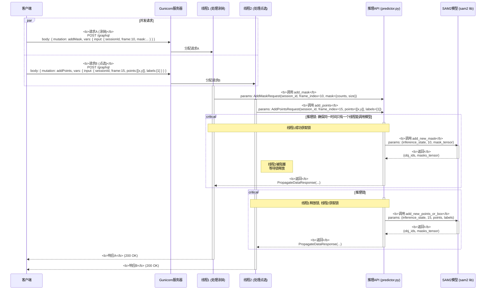
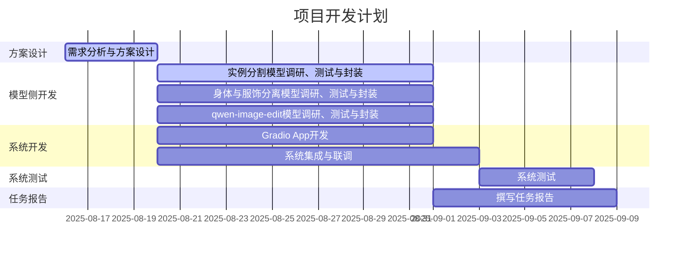

## 概要
1. 经验证，SAM2的demo面向视频流分割设计，且UI与预期大相径庭，无法作为二次开发的基础；但对并发需求的处理、消息的封装逻辑可以作为参考；
2. 新思路，拟基于gradio开发：混元3D模型的gradio demo可以作为二次开发的基础，通过部署和测试，确定效果良好，满足需要；gradio支持热加载，方便开发中测试；gradio的前端和后端都基于python，对新手比较友好；
3. 衣物和人体分开生成：首先从图片中分割出完整的角色；然后，基于visual try-on领域的模型，分离人体和衣物。
4. 处理分割时的遮挡问题：先分割，再送进生成式的补全模型；或者使用已经将分割和补全集成了的模型；
5. 引入文本驱动的图像编辑功能，提高自由度：测试新发布的阿里qwen-image-edit模型，能否通过提示工程达到较好的分割和生成效果。
## 1.总体思路更新
本系统旨在实现一种可交互的、针对图像局部区域的2D内容编辑和3D内容生成方案。
核心技术路线为“**图像编辑 + 条件化3D生成**”。用户通过Web界面上传图片，然后可以使用多种方式进行编辑（交互式实例分割、角色身体和服饰分离、文本驱动的细粒度编辑），最后将结果图像作为关键条件，驱动混元3D模型生成高质量的3D资产。
## 2.开发方面工作
### 2.1.SAM2 Demo分析和测试
可以写的内容：SAM2模型的分割效果展示、SAM2 Demo展示、对SAM2 Demo的分析（可以参考SAM2_Demo_Analysis，并发请求处理和消息封装可以参考这里的)
***这张图可用***。下面的序列图展示了系统如何通过“多线程+锁”机制处理两个并发请求——请求A（涂抹）和请求B（点选）。后端并发请求执行流图，

1.  **并发到达**: 客户端几乎同时发送了两个不同的GraphQL Mutation请求：请求A（涂抹）和请求B（点选）。
2.  **分发**: Gunicorn服务器接收到这两个请求，并从其线程池中分别派出`线程1`处理请求A，`线程2`处理请求B。
3.  **并行执行**: `线程1`和`线程2`开始并行执行。它们各自调用`InferenceAPI`上对应的方法 (`add_mask` 和 `add_points`)。
4.  **锁竞争**:
    *   假设`线程1`先到达`with self.inference_lock:`代码块，它成功**获取了推理锁**，并继续执行，向`SAM2模型`发起调用。
    *   几乎同时，`线程2`也到达了`with self.inference_lock:`代码块。但因为它检测到锁已被`线程1`持有，所以`线程2`**被阻塞**，进入等待状态。
5.  **串行推理**:
    *   `线程1`完成模型推理，拿到结果，退出临界区，并**释放了推理锁**。
    *   `线程2`检测到锁被释放，立即**获取该锁**，然后才开始向`SAM2模型`发起调用。
6.  **并行返回**: 两个线程在各自完成推理和后续处理后，分别向客户端返回响应。虽然模型推理是串行的，但请求的接收、准备和响应的发送过程是可以并发的。

这个流程清晰地展示了系统如何利用多线程处理I/O，同时又通过锁机制保证了核心计算资源（AI模型）的线程安全和执行顺序。
### 2.2.混元3D模型 Gradio Demo分析和测试
可以写的内容同上
### 2.3.工作流和UI的整体设计
可以放我画的草图，附上描述
## 3.算法（模型）方面工作
模型名字、框架图、工作流程介绍、效果展示
### 2.1.实例分割方面
可以处理轻微遮挡的实例分割模型
### 2.2.身体和服饰分离方面
### 2.3.Qwen-Image-Edit模型
## 3.开发计划更新
### 3.1 任务分工
组长，主持日常工作：杜斌
汇报，外联：王雯睿
算法组，负责解决方案，相关模型的调研、测试，系统的联合测试：王雯睿、杜斌
开发组，负责系统设计和开发：党浩川、刘文博

| 任务模块                   | 负责人     | 预计工时(人日) |
| ---------------------- | ------- | -------- |
| 需求分析与系统方案设计            | 所有人     | 4        |
| 实例分割模型调研与封装            | 党浩川、刘文博 | 12       |
| 身体与服饰分离模型调研与封装         | 王雯睿     |          |
| qwen-image-edit模型调研与封装 | 杜斌      | 12       |
| Gradio App开发           | 党浩川、刘文博 | 12       |
| 系统集成与联调                | 党浩川、刘文博 | 14       |
| 系统测试                   | 王雯睿、杜斌  | 6        |
| 任务报告                   | 所有人     | 10       |

### 3.2 开发计划

