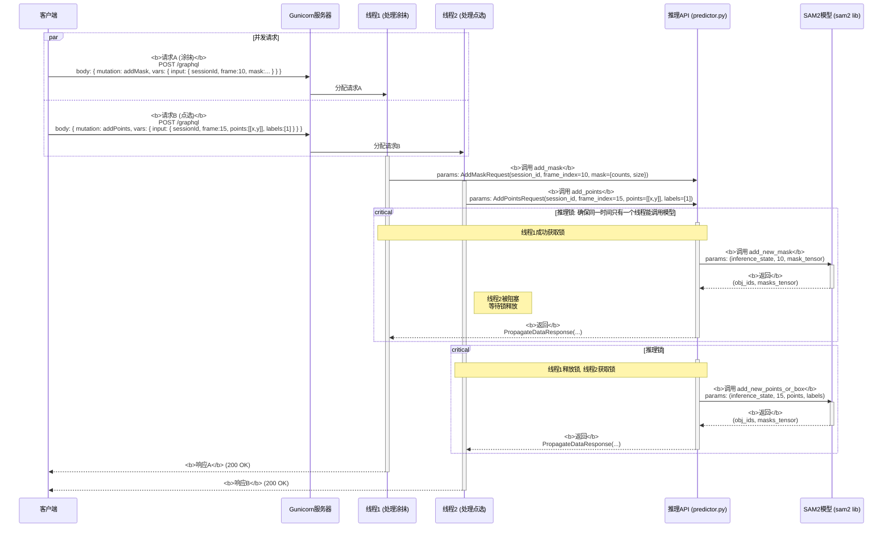
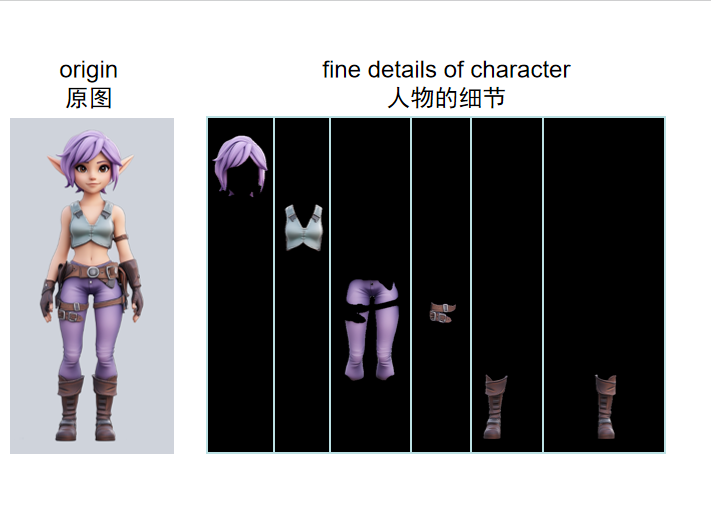
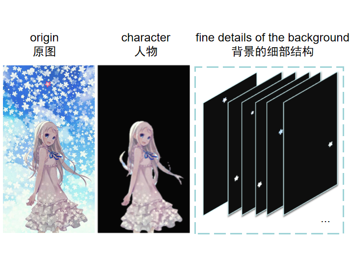
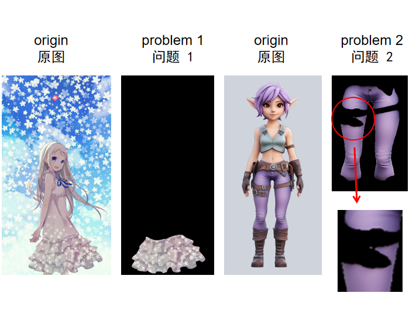
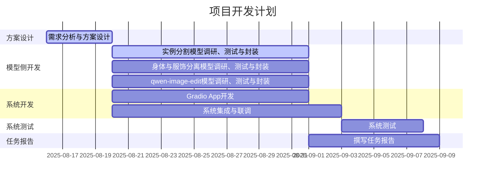

## 概要
1. 经验证，SAM2的demo面向视频流分割设计，且UI与预期大相径庭，无法作为二次开发的基础；但对并发需求的处理、消息的封装逻辑可以作为参考；
2. 新思路，拟基于gradio开发：混元3D模型的gradio demo可以作为二次开发的基础，通过部署和测试，确定效果良好，满足需要；gradio支持热加载，方便开发中测试；gradio的前端和后端都基于python，对新手比较友好；
3. 衣物和人体分开生成：首先从图片中分割出完整的角色；然后，基于visual try-on领域的模型，分离人体和衣物。
4. 处理分割时的遮挡问题：先分割，再送进生成式的补全模型；或者使用已经将分割和补全集成了的模型；
5. 引入文本驱动的图像编辑功能，提高自由度：测试新发布的阿里qwen-image-edit模型，能否通过提示工程达到较好的分割和生成效果。
## 1.总体思路更新
本系统旨在实现一种可交互的、针对图像局部区域的2D内容编辑和3D内容生成方案。
核心技术路线为“**图像编辑 + 条件化3D生成**”。用户通过Web界面上传图片，然后可以使用多种方式进行编辑（交互式实例分割、角色身体和服饰分离、文本驱动的细粒度编辑），最后将结果图像作为关键条件，驱动混元3D模型生成高质量的3D资产。
## 2.开发方面工作
### 2.1.SAM2 Demo分析和测试
可以写的内容：SAM2模型的分割效果展示、SAM2 Demo展示、对SAM2 Demo的分析（可以参考SAM2_Demo_Analysis，并发请求处理和消息封装可以参考这里的)
***这张图可用***。下面的序列图展示了系统如何通过“多线程+锁”机制处理两个并发请求——请求A（涂抹）和请求B（点选）。后端并发请求执行流图，

1.  **并发到达**: 客户端几乎同时发送了两个不同的GraphQL Mutation请求：请求A（涂抹）和请求B（点选）。
2.  **分发**: Gunicorn服务器接收到这两个请求，并从其线程池中分别派出`线程1`处理请求A，`线程2`处理请求B。
3.  **并行执行**: `线程1`和`线程2`开始并行执行。它们各自调用`InferenceAPI`上对应的方法 (`add_mask` 和 `add_points`)。
4.  **锁竞争**:
    *   假设`线程1`先到达`with self.inference_lock:`代码块，它成功**获取了推理锁**，并继续执行，向`SAM2模型`发起调用。
    *   几乎同时，`线程2`也到达了`with self.inference_lock:`代码块。但因为它检测到锁已被`线程1`持有，所以`线程2`**被阻塞**，进入等待状态。
5.  **串行推理**:
    *   `线程1`完成模型推理，拿到结果，退出临界区，并**释放了推理锁**。
    *   `线程2`检测到锁被释放，立即**获取该锁**，然后才开始向`SAM2模型`发起调用。
6.  **并行返回**: 两个线程在各自完成推理和后续处理后，分别向客户端返回响应。虽然模型推理是串行的，但请求的接收、准备和响应的发送过程是可以并发的。

这个流程清晰地展示了系统如何利用多线程处理I/O，同时又通过锁机制保证了核心计算资源（AI模型）的线程安全和执行顺序。
### 2.2.混元3D模型 Gradio Demo分析和测试
部署效果图
![[Pasted image 20250821163646.png]]
### 2.3.工作流和UI的整体设计
UI设计草图
![[Pasted image 20250821163319.png]]
### 2.4.SAM的Gradio Demo实现
<video width="640" height="360" controls>
  <source src="sam-gradio.mp4" type="video/mp4">
</video>

## 3.算法（模型）方面工作
### 3.1.实例分割方面
#### 3.1.1. Segment Anything Model (SAM)模型介绍
**Segment Anything Model (SAM)** 是 **Meta** 发布的一种开创性基础分割模型。  
其核心能力在于通过提示（如点、框、文本）与图像进行交互，从而 **高效、精准地** 生成高质量的分割掩码。  
我们选择 **SAM1** 而非 SAM2 作为当前开发基础，因为：
- SAM1 的模型权重 **完全开源**
- 生态成熟，便于 **封装与集成**
#### 3.1.2. 框架与工作流程
SAM 的工作流程是一个 **“提示-分割”闭环**，主要包含以下步骤：

| 步骤 | 说明 |
|---|---|
| **图像编码** | 图像通过 **ViT（Vision Transformer）编码器** 生成一次性 **图像嵌入（Image Embedding）**。 该步骤计算量最大，但只需执行一次。 |
| **提示编码** | 用户交互提示（如点击的点、绘制的框）被编码为 **提示嵌入（Prompt Embedding）**。 |
| **轻量级解码** | 图像嵌入和提示嵌入共同输入 **轻量掩码解码器**，实时（约 50ms 内）预测分割掩码。 |
| **输出** | 模型可输出 **多个可能的分割结果** 及其 **置信度**，供用户选择。 |

#### 3.1.3. 效果展示
经过测试，**SAM1** 在各类图像上展现出强大的基础分割能力，但也存在固有局限。
##### 3.1.3.1 卓越效果
###### ① “非常 3D 的 2D”动漫角色
- **场景**：立体感强、光影分明、轮廓清晰的二次元图像（示例见下图）。  
- **表现**：  
  - 一次性完整抠出角色主体，与背景彻底分离；  
  - 通过 **点/框提示** 可进一步细化：头发、脸部、肢体、主要服饰独立成块；  
  - 为后续 **3D 生成 / 独立编辑** 奠定坚实基础。

> 图 1 高质量动漫图分割效果  
> 

###### ② 复杂背景处理
- **场景**：背景杂乱、含多个物体。  
- **表现**：  
  - 仍能准确提取前景角色；  
  - 可顺带分离背景小物件，泛化能力突出。

> 图 2 复杂背景下的分割  
> 

---

##### 3.1.3.2 存在的不足

| 问题场景 | 具体表现 | 示例图 |
|---|---|---|
| **扁平风格 2D 动漫图** | 色彩平坦、线条简洁，缺乏纹理细节 → SAM1 找不到清晰边界 | 点击上衣后，仅分割出色块而非完整衣物 |
| **小部件精度** | 发丝、首饰、小物件边缘锯齿或缺失 | 需后期修图或二次算法 |

> 图 3 扁平风格分割挑战  
> 

---

##### 小结
- **优势**：高立体感、高对比度场景下表现极佳。  
- **短板**：扁平风格、语义理解、小部件细节仍需提示优化或后处理。
### 2.2.身体和服饰分离方面

在通过SAM1成功从原图中分割出完整的角色后，下一关键步骤是将角色进一步分解为**人体（身体）** 和**衣物**两个独立部分。我们拟采用Visual Try-on（虚拟试穿）领域的技术方案来解决这一问题。

#### 技术方案与工作流程

我们的方案分为两个核心阶段，其完整流程如下图所示：
sequenceDiagram
    box rgb(200, 230, 255) 第一阶段：角色提取
    participant User
    participant System
    participant SAM_Module
    end
    
    box rgb(200, 255, 230) 第二阶段：衣物与人体分离
    participant TryOnDiff_Module
    participant Person_Parser
    participant Garment_Extractor
    participant 3D_Generator
    end

    Note over User, SAM_Module: 输入: 用户上传的原始图片
    User->>System: 上传输入图像
    System->>SAM_Module: 请求交互式分割 (用户点选或框选)
    Note right of SAM_Module: 过程: 利用SAM1模型精准分割目标角色
    SAM_Module-->>System: 返回完整角色图像 (背景透明/纯色)
    Note right of System: 目的: 为后续模型提供高质量输入 消除背景干扰
    
    Note over TryOnDiff_Module, 3D_Generator: 输入: 第一阶段得到的角色图像
    System->>TryOnDiff_Module: 发送角色图像
    
    Note over TryOnDiff_Module, Person_Parser: 过程: 使用TryOnDiff模型处理
    TryOnDiff_Module->>Person_Parser: 请求人物解析
    Person_Parser-->>TryOnDiff_Module: 返回人体姿态与解析图
    
    TryOnDiff_Module->>Garment_Extractor: 请求衣物提取(使用解析图)
    Garment_Extractor-->>TryOnDiff_Module: 返回分离的衣物图像
    
    TryOnDiff_Module-->>System: 返回纯衣物图
    TryOnDiff_Module-->>System: 返回人体结构图(姿态+解析图)
    
    System->>3D_Generator: 发送纯衣物图+人体结构图
    3D_Generator-->>System: 返回3D生成结果
    System-->>User: 显示最终3D资产
1.  **第一阶段：角色提取**
    *   **输入**：用户上传的原始图片。
    *   **过程**：利用**SAM1模型**，通过用户交互（点选或框选），精准地分割出图片中的目标角色，并将其裁剪出来，得到一张背景透明或纯色的、只包含完整角色的图像。
    *   **目的**：为后续专业模型提供高质量的输入，消除背景干扰。

2.  **第二阶段：衣物与人体分离**
    *   **输入**：第一阶段得到的角色图像。
    *   **过程与模型**：将该图像输入至虚拟试穿模型，例如 **TryOnDiff**（一种基于Diffusion的先进试穿模型）。此类模型的工作流程通常包含：
        *   **人物解析（Human Parsing）**：首先使用一个预训练的人体解析模型（如SCHP、ATR等）对角色图像进行语义分割，将图像中的每个像素分类为不同的标签，如皮肤、头发、上衣、裤子、裙子、鞋子等，生成一张解析图（Parse Map）。
        *   **姿态估计（Pose Estimation）**：同时，估计出人物的关键点姿态信息。
        *   **衣物提取**：模型的核心能力在于，它能根据解析图，将指定的衣物类别（如上衣）从角色中“剥离”出来，生成一张**仅包含目标衣物的、平整的**图像（通常称为“ garment image”），这个过程会自动尝试补全被遮挡部分的边缘。
    *   **输出**：
        *   **分离后的衣物图**：高质量的、可用于后续重新渲染或替换的衣物图像。
        *   **包含人体结构信息的表示**：如人体解析图、姿态关键点图等。这些信息共同定义了人体的“结构和姿态”， effectively serving as a representation of the **human body** for the next step of conditional generation.

#### 面临的核心局限与挑战

尽管上述方案在技术上可行，但我们面临一个由**伦理约束**导致的重大挑战：

*   **“人体”模型的缺失**：由于严格的伦理和隐私保护政策，目前学术界和工业界**没有、也不会公开提供**能够直接从图片中“剥离”出完整、裸露人体（naked body）的模型。任何此类公开尝试都会面临巨大的风险和被下架的命运。TryOnDiff等模型的设计初衷是“提取衣物”和“将新衣物贴合到人体上”，而非“输出人体”。它们只能输出代表人体结构和语义的**参数化表示**（如解析图、姿态图），而非真实的人体图像像素。

#### 结论与应对策略

因此，我们对该环节的现状总结如下：

1.  **衣物分离可行**：利用TryOnDiff等模型，**一键提取高质量衣物**是完全可以实现的。
2.  **人体分离不可行**：**无法直接分离出真实的人体图像**。我们得到的是对人体的一种**结构化表示**（解析图+姿态图）。

**应对策略**：
在后续的3D生成或编辑流程中，我们不能提供一个“真实人体”图片作为条件，而需要：
*   将**人体解析图**和**姿态图**作为条件输入到3D生成模型（如混元3D）中，来指导人体结构的生成。
*   或者，依赖生成模型本身的内置先验知识，根据输入的编辑后图像（如换了新衣服的角色）来推理和重建被衣物遮挡的人体部分。
### 2.3.Qwen-Image-Edit模型
[Qwen-Image-Edit](https://www.modelscope.cn/models/Qwen/Qwen-Image-Edit),文本驱动的图像编辑模型。部署满血版需要大约60GB显存，量化版本需要大约20GB显存。
可以通过[千问AI](https://chat.qwen.ai/)->图像编辑试用。
用途：
1. 通过角色的半身图生成全身图；
2. 从不同姿势/视角的角色图片生成正面的T-pose图片，能够大幅度缓解角色肢体和服饰间的遮挡问题，便于生成；
3. 对于分割出来的部件，补全被遮挡的细节。
工作流展示：
![[Pasted image 20250821163210.png]]

## 3.开发计划更新
### 3.1 任务分工
组长，主持日常工作：杜斌
汇报，外联：王雯睿
算法组，负责解决方案，相关模型的调研、测试，系统的联合测试：王雯睿、杜斌
开发组，负责系统设计和开发：党浩川、刘文博

| 任务模块                   | 负责人     | 预计工时(人日) |
| ---------------------- | ------- | -------- |
| 需求分析与系统方案设计            | 所有人     | 4        |
| 实例分割模型调研与封装            | 党浩川、刘文博 | 12       |
| 身体与服饰分离模型调研与封装         | 王雯睿     |          |
| qwen-image-edit模型调研与封装 | 杜斌      | 12       |
| Gradio App开发           | 党浩川、刘文博 | 12       |
| 系统集成与联调                | 党浩川、刘文博 | 14       |
| 系统测试                   | 王雯睿、杜斌  | 6        |
| 任务报告                   | 所有人     | 10       |

### 3.2 开发计划

