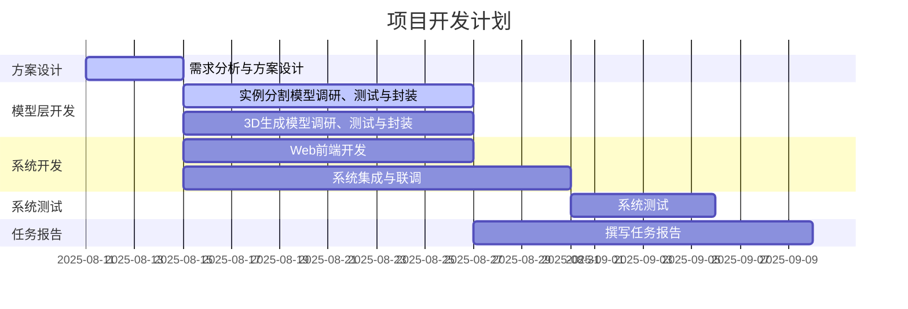

## 概要
1. 经验证，SAM2的demo面向视频流分割设计，且UI与预期大相径庭，无法作为二次开发的基础；但对并发需求的处理、消息的封装逻辑可以作为参考；
2. 新思路，拟基于gradio开发：混元3D模型的gradio demo可以作为二次开发的基础，通过部署和测试，确定效果良好，满足需要；gradio支持热加载，方便开发中测试；gradio的前端和后端都基于python，对新手比较友好；
3. 衣物和人体分开生成：首先从图片中分割出完整的角色；然后，基于visual try-on领域的模型，分离人体和衣物。
4. 处理分割时的遮挡问题：先分割，再送进生成式的补全模型；或者使用已经将分割和补全集成了的模型；
5. 引入文本驱动的图像编辑功能，提高自由度：测试新发布的阿里qwen-image-edit模型，能否通过提示工程达到较好的分割和生成效果。
## 1.总体思路更新
本系统旨在实现一种可交互的、针对图像局部区域的2D内容编辑和3D内容生成方案。
核心技术路线为“**图像编辑 + 条件化3D生成**”。用户通过Web界面上传图片，然后可以使用多种方式进行编辑（交互式实例分割、角色身体和服饰分离、文本驱动的细粒度编辑），最后将结果图像作为关键条件，驱动混元3D模型生成高质量的3D资产。
## 2.开发方面工作
### 2.1.SAM2 Demo分析和测试
可以写的内容：SAM2模型的分割效果展示、SAM2 Demo展示、对SAM2 Demo的分析（可以参考SAM2_Demo_Analysis，把并发请求设计和消息封装可以参考这里的)
### 2.2.混元3D模型 Gradio Demo分析和测试
### 2.3.工作流和UI的整体设计

## 3.算法（模型）方面工作
### 2.1.实例分割方面
### 2.2.身体和服饰分离方面
### 2.3.Qwen-Image-Edit模型
## 3.开发计划更新
### 3.1 任务分工
主要分成算法组（王雯睿、杜斌）和开发组（党浩川、刘文博）。算法组负责解决方案，相关模型的调研、测试，系统的联合测试；平台组负责系统设计和开发。

| 任务模块        | 负责人     | 预计工时(人日) |
| ----------- | ------- | -------- |
| 需求分析与系统方案设计 | A,B,C,D | 4        |
| 实例分割模型调研与封装 | C       | 12       |
| 3D生成模型调研与封装 | D       | 12       |
| Web前端开发     | A       | 12       |
| 系统集成与联调     | B       | 14       |
| 系统测试        | C,D     | 6        |
| 任务报告        | A,B,C,D | 14       |

### 7.2 开发计划甘特图

