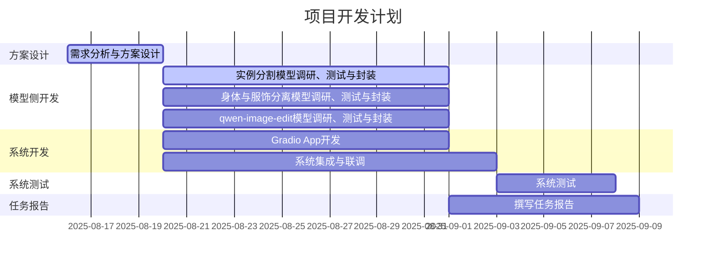

## 概要
1. 已经将SAM、Qwen-Image-Edit、Qwen-Inapinting、Gemini Chat、Hunyuan3D功能初步集成起来。
2. SAM：分割实例；
3. Qwen-Image-Edit：图像全局重绘，用来缓解遮挡问题、补全视图外细节（例如半身到全身）；
4. Qwen-Inpainting：图像局部重绘，用于提取人体（重绘服饰部分）/提取衣物（重绘人体部分），修复缺失的局部细节；
5. Gemini Chat：视觉语言模型，用于辅助撰写提示词；
6. Hunyuan3D：生成3D模型。
## 1.开发方面工作
 已经将SAM、Qwen-Image-Edit、Qwen-Inapinting、Gemini Chat、Hunyuan3D功能初步集成起来。
 
## 2.测试方面工作
见demo
## 3.本周分工

| 负责人 | 任务                                                                                       |     |
| --- | ---------------------------------------------------------------------------------------- | --- |
| 杜斌  | 实现和集成Qwen-Image-Edit、Qwen-Inpainting、Gemini Chat前端， ComfyUI Qwen-Inpainting后端，Gemini API |     |
| 党浩川 | 优化SAM、Hunyuan子页面的布局，debug                                                                |     |
| 刘文博 | 开发文件树部分，加入文件树和SAM以及Hunyuan的接口                                                                                  |     |
| 王雯睿 | 测试stable-difussion和nano banana的衣物分离效果，准备测试数据集，工作流测试，汇报                                                             |     |
| 葛俊辰 | 测试Qwen、SAM、Hunyuan功能模块的并发性能                                                                                         |     |
| 罗雅淇 | 优化主界面UI,添加标题                             |     |
| 黄耀祖 |                                                                                          |     |
| 所有人 | 本周报告                                                                                     |     |

### 3.2 日程安排
无变化，正常推进。文件树部分受阻，fileExplorer不能满足设计效果，且尚未解决不能正确刷新的bug。

