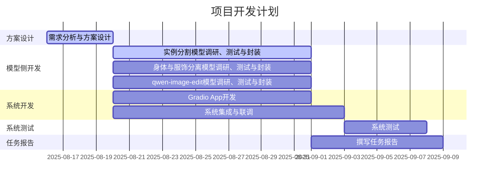

## 概要
1. 已经将SAM、Qwen-Image-Edit、Qwen-Inapinting、Gemini Chat、Hunyuan3D功能初步集成起来。
2. SAM：分割实例；
3. Qwen-Image-Edit：图像全局重绘，用来缓解遮挡问题、补全视图外细节（例如半身到全身）；
4. Qwen-Inpainting：图像局部重绘，用于提取人体（重绘服饰部分）/提取衣物（重绘人体部分），修复缺失的局部细节；
5. Gemini Chat：视觉语言模型，用于辅助撰写提示词；
6. Hunyuan3D：生成3D模型。
## 1.开发方面工作
 已经将SAM、Qwen-Image-Edit、Qwen-Inapinting、Gemini Chat、Hunyuan3D功能初步集成起来。
 
## 2.测试方面工作

## 3.本周分工
自行填写

| 负责人 | 任务                                                            |     |
| --- | ------------------------------------------------------------- | --- |
| 杜斌  | UI和框架设计、Qwen-Image-Edit API                                   |     |
| 党浩川 | 集成了SAM模型组件；完成SAM分割模块的集成和测试并解决sam分割遇到的问题                       |     |
| 刘文博 | 加入了文件树的组件，进行文件的可视化和管理                                         |     |
| 王雯睿 | 衣物和人体分离功能，发言                                                  |     |
| 葛俊辰 | 统一了SAM、hunyuan生成和文件系统的通信方式，实现生成和编辑的同步进行；完成hunyuan3D生成模块的集成和测试 |     |
| 罗雅淇 | 完成Qwen-Image-Edit 基于gradio的UI界面开发                             |     |
| 黄耀祖 |                                                               |     |
| 所有人 | 本周报告                                                          |     |

### 3.2 日程安排
无变化，正常推进。

## 4.下周工作安排
开发侧：
1. 集成人体和衣物分离功能。
2. 各个模型的后端处理并发请求。
3. 通过拖拽完成文件交互。
4. 系统优化、完善。
5. 项目报告中的开发部分。

模型侧：
1. 起草项目报告大纲。
2. 项目报告中的模型部分。
3. 系统测试及测试报告。