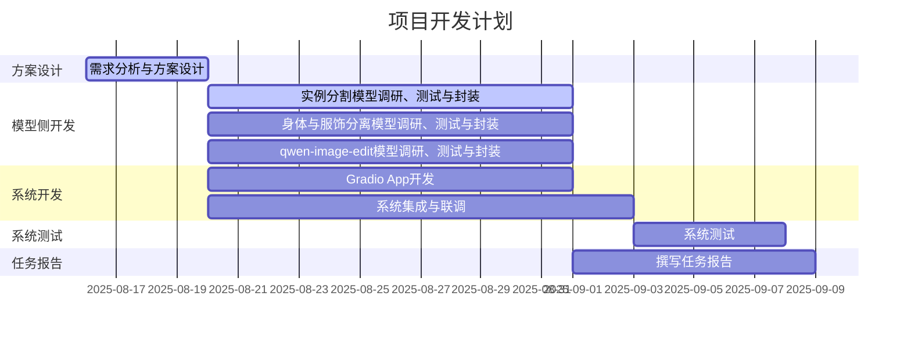

## 概要
1. 已经将SAM、Qwen-Image-Edit、Qwen-Inapinting、Gemini Chat、Hunyuan3D功能初步集成起来。
2. 

## 3.开发计划更新
### 3.1 任务分工
组长，主持日常工作：杜斌
汇报，外联：王雯睿
算法组，负责解决方案，相关模型的调研、测试，系统的联合测试：王雯睿、杜斌
开发组，负责系统设计和开发：党浩川、刘文博

| 任务模块                   | 负责人     | 预计工时(人日) |
| ---------------------- | ------- | -------- |
| 需求分析与系统方案设计            | 所有人     | 4        |
| 实例分割模型调研与封装            | 党浩川、刘文博 | 12       |
| 身体与服饰分离模型调研与封装         | 王雯睿     |          |
| qwen-image-edit模型调研与封装 | 杜斌      | 12       |
| Gradio App开发           | 党浩川、刘文博 | 12       |
| 系统集成与联调                | 党浩川、刘文博 | 14       |
| 系统测试                   | 王雯睿、杜斌  | 6        |
| 任务报告                   | 所有人     | 10       |

### 3.2 日程安排

## 4.下周工作安排
开发侧：
1. 尝试将SAM和hunyuan进行拼接，通过点击功能标签调出相应工作区（UI会议之前）；
2. 暂时不考虑并发，跑通线形流程再说；
3. 暂定于下周一/二开会讨论前端和后端的细部设计，开发小组内部可以先行调研和分析，与其他成员沟通。

模型侧：
1. 继续调研衣体分离模型，尽量能够适应3D Anime风格。
2. 量化版qwen-image-edit部署；
3. qwen-image-edit提示工程，设置一些示例提示词，能够达到较好的编辑效果；
4. 建立3D Anime图像数据集，风格接近混元Demo中的示例，用于平时的测试。